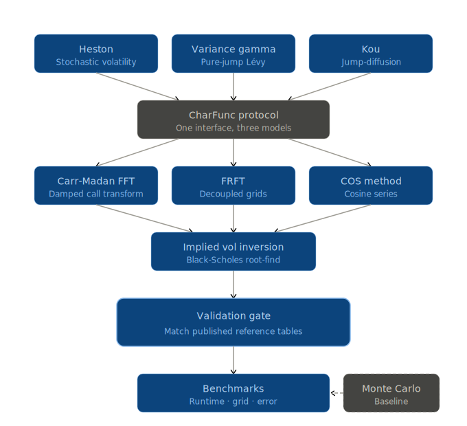

# fourier-option-pricer

A compact Fourier-pricing library for European options under characteristic-function models.

This repository implements three Fourier-based pricers — Carr–Madan FFT, FRFT, and COS — behind a common characteristic-function interface, with model support for Heston, Variance Gamma, and Kou. Monte Carlo is included as a baseline for comparison, but the focus of the project is deterministic pricing methods suited to surface generation, validation, and calibration workflows.

The guiding principle is simple: a method is only treated as implemented once it reproduces published reference values within an explicit numerical tolerance.

---

## Overview

The project is organized around four components:

- **Models**
  - Heston
  - Variance Gamma
  - Kou

- **European pricers**
  - Carr–Madan FFT
  - FRFT
  - COS

- **Numerical utilities**
  - implied-volatility inversion
  - interpolation helpers
  - cumulant and truncation utilities
  - benchmarking harnesses

- **Validation**
  - tests and notebooks that replicate published benchmark results before performance comparisons are reported

---

## End-to-end workflow



1. Implement the model characteristic function

$$
\varphi_T(u) = \mathbb{E}^{\mathbb{Q}}\left[e^{iuX_T}\right]
$$

where

$$
X_T = \log\!\left(\frac{S_T}{F_0}\right), \qquad F_0 = S_0 e^{(r-q)T}.
$$

2. Price a strip of strikes with FFT, FRFT, or COS.
3. Convert prices to implied volatilities with a robust root finder.
4. Validate prices against published reference tables.
5. Run timing and accuracy comparisons once validation has passed.

---

## Why Fourier methods are the focus

Monte Carlo is flexible, but it is generally not the right primary tool for European implied-volatility surfaces under characteristic-function models.

Its standard error scales as

$$
\varepsilon_{\mathrm{MC}} = O\!\left(n^{-1/2}\right),
$$

so reducing error by one order of magnitude typically requires roughly two orders of magnitude more paths. In a calibration setting — where prices must be computed repeatedly across strikes, maturities, and optimizer iterations — that trade-off is expensive.

For European options under models with tractable characteristic functions, Fourier inversion delivers deterministic prices and typically a materially better runtime-versus-accuracy profile.

Monte Carlo is therefore retained here as a baseline for benchmarking and error comparison rather than as the core production method.

---

## Common characteristic-function interface

All models conform to a shared protocol:

```python
from typing import Protocol
import numpy as np

class CharFunc(Protocol):
    def __call__(self, u: np.ndarray) -> np.ndarray:
        """Return phi_T(u) = E^Q[exp(i u X_T)] for X_T = log(S_T / F0)."""
        ...
```

Once a model exposes $\varphi_T(u)$, it can be priced by FFT, FRFT, or COS without any model-specific changes to the pricer layer.

---

## Pricing methods

### Carr–Madan FFT

Carr–Madan prices a damped call transform on a uniform frequency grid, then uses the FFT to recover prices across a corresponding log-strike grid.

Key parameters:

- damping parameter $\alpha$
- grid size $N$
- frequency spacing $\eta$

with strike spacing

$$
\lambda = \frac{2\pi}{N\eta}.
$$

Its main numerical feature is that strike resolution and frequency resolution are coupled through the grid construction.

### FRFT

FRFT relaxes the tight coupling between frequency and strike grids present in the plain FFT setup. In practice, this often allows comparable pricing accuracy with more flexible grid design and, in some regimes, lower computational cost than standard FFT.

### COS

COS prices by expanding the density on a finite truncation interval $[a,b]$ using a cosine series. The density need not be written explicitly; the expansion coefficients are recovered directly from the characteristic function.

A standard cumulant-based truncation rule is

$$
[a,b] = \left[c_1 - L\sqrt{c_2 + \sqrt{c_4}}, \; c_1 + L\sqrt{c_2 + \sqrt{c_4}}\right].
$$

For Kou, COS remains feasible in principle. When performance deteriorates, the issue is usually the truncation design or implementation details rather than the jump structure itself.

---

## Model conventions

The repository works in **log-forward coordinates**:

$$
X_T = \log\!\left(\frac{S_T}{F_0}\right), \qquad F_0 = S_0 e^{(r-q)T}.
$$

All characteristic functions below are therefore characteristic functions of $X_T$, not of $\log S_T$.

If the characteristic function of $\log S_T$ is needed instead, it is obtained by multiplying by

$$
e^{iu\log F_0}.
$$

A notation warning: the symbol $\nu$ is reused across models. In Heston it denotes vol-of-vol; in Variance Gamma it denotes the variance rate of the gamma time change. Its meaning is always model-specific.

---

## Characteristic functions

### Heston

Parameters: $\kappa, \theta, \nu, \rho, v_0$, where $\nu$ is the vol-of-vol.

Define

$$
b(u) = \kappa - \rho\nu i u,
$$

$$
d(u) = \sqrt{b(u)^2 + \nu^2(u^2 + iu)},
$$

$$
g(u) = \frac{b(u) - d(u)}{b(u) + d(u)}.
$$

Using the numerically stable “Formulation 2” / “Little Heston Trap” representation with $e^{-d(u)T}$,

$$
D(u,T) = \frac{b(u) - d(u)}{\nu^2} \cdot \frac{1 - e^{-d(u)T}}{1 - g(u)e^{-d(u)T}},
$$

$$
C(u,T) = \frac{\kappa\theta}{\nu^2}\left[(b(u) - d(u))T - 2\log\!\left(\frac{1 - g(u)e^{-d(u)T}}{1 - g(u)}\right)\right].
$$

The log-forward characteristic function is then

$$
\varphi_H(u) = \exp\!\left(C(u,T) + D(u,T)v_0\right).
$$

This formulation is preferred numerically because the original algebraically equivalent representation can cross an undesirable complex-log branch and produce unstable prices.

### Variance Gamma

Parameters: $\sigma, \nu, \theta$, where $\nu$ is the variance rate of the gamma time change.

The martingale correction is

$$
\omega = \frac{1}{\nu}\log\!\left(1 - \theta\nu - \tfrac{1}{2}\sigma^2\nu\right),
$$

which requires

$$
1 - \theta\nu - \tfrac{1}{2}\sigma^2\nu > 0.
$$

Under the log-forward convention,

$$
\varphi_{VG}(u) = \exp(iu\omega T)\left(1 - i\theta\nu u + \tfrac{1}{2}\sigma^2\nu u^2\right)^{-T/\nu}.
$$

### Kou

Parameters: $\sigma, \lambda, p, \eta_1, \eta_2$, with jump-size density

$$
f_Y(y) = p\eta_1 e^{-\eta_1 y}\mathbf{1}_{\{y \ge 0\}} + (1-p)\eta_2 e^{\eta_2 y}\mathbf{1}_{\{y < 0\}}.
$$

The jump characteristic function is

$$
\varphi_Y(u) = \frac{p\eta_1}{\eta_1 - iu} + \frac{(1-p)\eta_2}{\eta_2 + iu}.
$$

The exponential-jump compensator is

$$
\zeta = \mathbb{E}[e^Y] - 1 = \frac{p\eta_1}{\eta_1 - 1} + \frac{(1-p)\eta_2}{\eta_2 + 1} - 1,
$$

which requires $\eta_1 > 1$.

Under the log-forward convention,

$$
X_T = \left(-\tfrac{1}{2}\sigma^2 - \lambda\zeta\right)T + \sigma W_T + \sum_{j=1}^{N_T} Y_j,
$$

so the characteristic function is

$$
\varphi_{Kou}(u) = \exp\!\left(iu\left(-\tfrac{1}{2}\sigma^2 - \lambda\zeta\right)T - \tfrac{1}{2}\sigma^2 u^2 T + \lambda T(\varphi_Y(u) - 1)\right).
$$

---

## Validation philosophy

The project treats validation as a hard gate, not as a cosmetic appendix.

A method is only regarded as correct once it reproduces published benchmark values within a stated tolerance. Performance comparisons are only meaningful after that step.

A sensible validation sequence is:

1. validate Carr–Madan FFT on published Variance Gamma benchmarks;
2. validate Heston prices against high-precision references, including at least one branch-cut stress case;
3. validate COS on published Heston tables;
4. extend to Kou once the core Fourier machinery is stable.

This ordering reduces debugging ambiguity by establishing one reliable method-model pair before broadening the matrix of supported methods.

---

## Benchmarking focus

Once validation passes, the main comparisons of interest are:

- runtime as a function of strike count;
- runtime as a function of grid size;
- pricing error relative to reference values;
- FFT versus FRFT versus COS;
- Monte Carlo baseline runtime and error.

These benchmarks are intended to quantify the runtime-accuracy trade-off across Fourier methods rather than simply report raw timings in isolation.

---

## Repository structure

```text
src/foureng/
  char_func/        # heston / vg / kou
  pricers/          # carr_madan / frft / cos
  iv/               # implied-vol inversion
  mc/               # Monte Carlo baselines
  utils/            # grids, interpolation, cumulants, numerics

tests/              # replication tests against published references
notebooks/          # validation and benchmark notebooks
```

---

## Development roadmap

### Phase 1
- Monte Carlo baseline
- timing versus strike count
- error-decay checks

### Phase 2
- Carr–Madan FFT for Variance Gamma and Heston
- validation against published benchmarks

### Phase 3
- FRFT implementation
- FFT versus FRFT benchmarking study

### Phase 4
- COS implementation
- validation on Heston, then extension to Kou subject to stable truncation design

### Phase 5
- Kou replication tests

### Phase 6
- optional extensions such as Greeks or control variates

### Phase 7
- packaging and library integration

---

## Possible extensions

After the core stack is validated, natural extensions include:

- Fourier-based Greeks;
- control-variate constructions using Fourier prices inside Monte Carlo;
- calibration routines;
- packaging as a reusable library or adapter layer for external tooling.

---

## PyFENG integration

PyFENG already provides useful option-pricing components in pure Python. The value of this repository is therefore not merely in re-implementing individual models, but in providing:

- a common characteristic-function abstraction;
- a unified validation harness;
- a consistent interface across multiple Fourier pricers.

That architecture makes cross-method comparison cleaner and keeps the codebase modular.

---

## References

Albrecher, H., Mayer, P., Schoutens, W. and Tistaert, J. (2007). The little Heston trap. *Wilmott Magazine*, January, 83–92. [[PDF](https://perswww.kuleuven.be/~u0009713/HestonTrap.pdf)]

Benhamou, E. (2002). Fast Fourier transform for discrete Asian options. *Journal of Computational Finance*, 6(1), 49–68. [[SSRN](https://papers.ssrn.com/sol3/papers.cfm?abstract_id=269491)]

Carr, P. and Madan, D.B. (1999). Option valuation using the fast Fourier transform. *Journal of Computational Finance*, 2(4), 61–73. [[PDF](https://engineering.nyu.edu/sites/default/files/2018-08/CarrMadan2_0.pdf)]

Chourdakis, K. (2004). Option pricing using the fractional FFT. *Journal of Computational Finance*, 8(2), 1–18. [[CiteSeer](https://citeseerx.ist.psu.edu/document?repid=rep1&type=pdf&doi=6bdf4696312d37427eda2740137650c09deacda7)]

Choi, J. and Wu, L. (2021). The equivalent constant-elasticity-of-variance (CEV) volatility of the stochastic-alpha-beta-rho (SABR) model. *Journal of Economic Dynamics and Control*, 128, 104143.

Fang, F. and Oosterlee, C.W. (2008). A novel pricing method for European options based on Fourier-cosine series expansions. *SIAM Journal on Scientific Computing*, 31(2), 826–848. [[Preprint](http://ta.twi.tudelft.nl/mf/users/oosterle/oosterlee/COS.pdf)] [[SIAM](https://epubs.siam.org/doi/10.1137/080718061)]

Hagan, P.S., Kumar, D., Lesniewski, A.S. and Woodward, D.E. (2002). Managing smile risk. *Wilmott Magazine*, September, 84–108. [[PDF](http://www.deriscope.com/docs/Hagan_2002.pdf)]

Heston, S.L. (1993). A closed-form solution for options with stochastic volatility. *Review of Financial Studies*, 6(2), 327–343. [[PDF](https://www.ma.imperial.ac.uk/~ajacquie/IC_Num_Methods/IC_Num_Methods_Docs/Literature/Heston.pdf)]

Kahl, C. and Jäckel, P. (2005). Not-so-complex logarithms in the Heston model. *Wilmott Magazine*, September, 94–103. [[PDF](http://www2.math.uni-wuppertal.de/~kahl/publications/NotSoComplexLogarithmsInTheHestonModel.pdf)]

Kou, S.G. (2002). A jump-diffusion model for option pricing. *Management Science*, 48(8), 1086–1101.

Lewis, A.L. (2001). A simple option formula for general jump-diffusion and other exponential Lévy processes. *Envision Financial Systems working paper*. [[SSRN](https://www.researchgate.net/publication/2499800_A_Simple_Option_Formula_for_General_Jump-Diffusion_and_Other_Exponential_Levy_Processes)]

Lord, R. and Kahl, C. (2010). Complex logarithms in Heston-like models. *Mathematical Finance*, 20(4), 671–694. [[Wiley](https://onlinelibrary.wiley.com/doi/abs/10.1111/j.1467-9965.2010.00416.x)]

Madan, D.B., Carr, P. and Chang, E.C. (1998). The Variance Gamma process and option pricing. *European Finance Review*, 2(1), 79–105.

---

*MATH5030 Numerical Methods in Finance — Columbia University MAFN, Spring 2026. Instructor: Prof. Jaehyuk Choi.*
