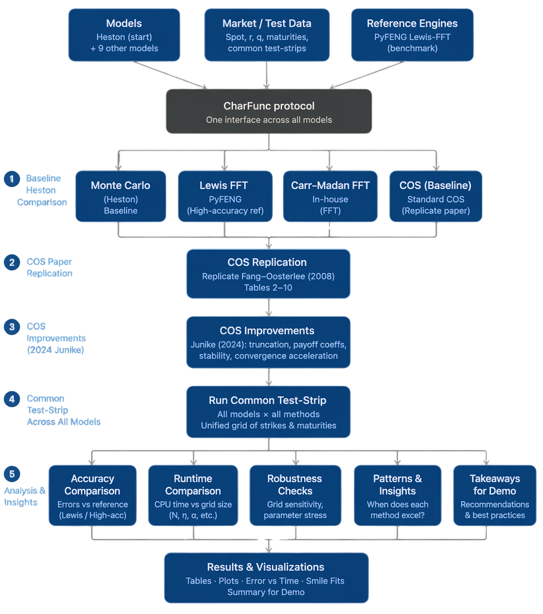
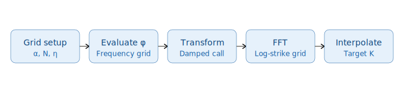
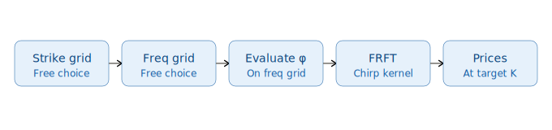
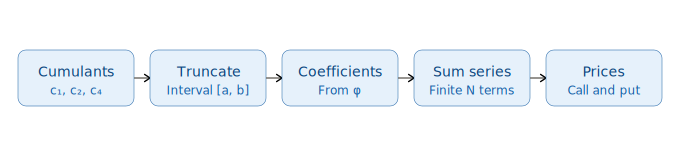
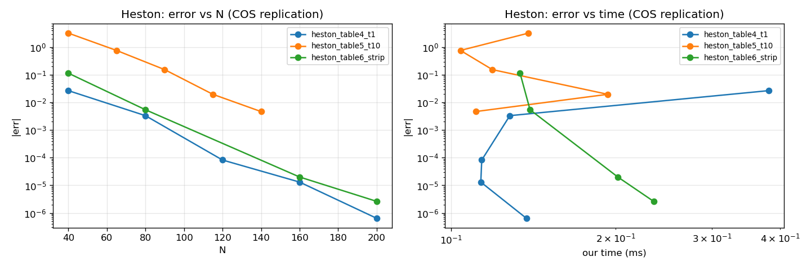
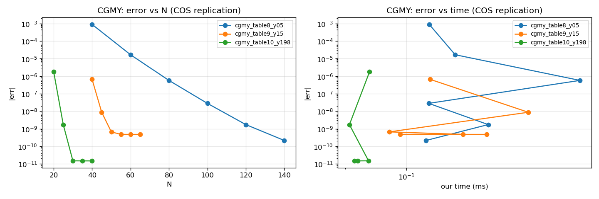
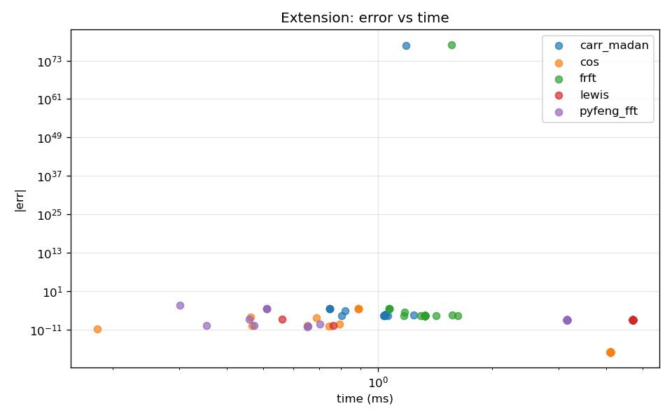
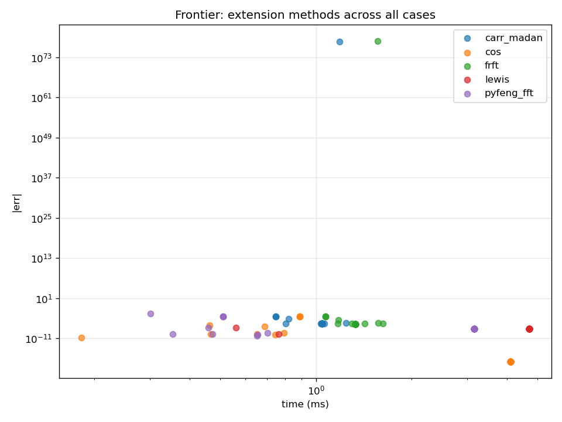

# fourier-option-pricer

This repository implements three Fourier-based pricers, that is, **Carr–Madan FFT**, **FRFT**, and **COS**,  behind a common characteristic-function interface, with support for ten models. The numerical focus is deterministic pricing for European options under models with tractable characteristic functions, with **Monte Carlo retained only as a baseline** for comparative purposes, in the form of accuracy, and speed. 

The main analytical thread of the project is not “implement every model from scratch, and indeed, LLMs are already so good at replicating papers.  Instead, it is:

1. build a **common characteristic-function interface**;
2. price the same model through **three different Fourier inversion methods**;
3. validate every method against **published references or independent numerical bmks**;
4. extend the framework to a small family of **stochastic-volatility + jump composites** built in-house.
5. compare across the three methods, it's accuracy, and speed, compared to benchmarks developed from **pyFENG**.

The in-house modelling thread expands Kou’s jump-diffusion idea into a family of **SVJ composites**:

- **Bates** = Heston + Merton lognormal jumps
- **Heston–Kou** = Heston + Kou double-exponential jumps
- **Heston–CGMY** = Heston + CGMY tempered-stable jumps

For all models where **PyFENG already provides a production-quality characteristic function**, we use the PyFENG implementation directly rather than re-derive it. This keeps the repository focused on the **numerical-methods contribution** -  the CF abstraction, the Fourier pricers, the validation logic, and the benchmarking harness.


---

## Overview

The project is organized around five layers.

### 1. Models ~  PyFENG-backed characteristic functions

These are thin adapters around `pyfeng.*Fft.charfunc_logprice`:

- Black–Scholes–Merton (`pyfeng.BsmFft`)
- Heston (`pyfeng.HestonFft`)
- Schöbel–Zhu OUSV (`pyfeng.OusvFft`)
- Variance Gamma (`pyfeng.VarGammaFft`)
- CGMY (`pyfeng.CgmyFft`)
- Normal Inverse Gaussian (`pyfeng.ExpNigFft`)

**Note:** Structure may have changed across iterations, but idea remaisn fundamentally the same. 

### 2. Models ~ in-house characteristic functions

These are not shipped by PyFENG and are implemented directly in this repository:

- Kou double-exponential jump diffusion
- Bates: Heston ⊗ Merton lognormal jumps
- Heston–Kou: Heston ⊗ Kou double-exponential jumps
- Heston–CGMY: Heston ⊗ CGMY tempered-stable jumps

**Note:** Latter three works, as the characteristic function, basically has the addition of one extra factor in the exponent. 


### 3. European pricers

All models can be priced through the same pricer layer:

- **Carr–Madan or Lewis FFT**
- **FRFT**
- **COS**

### 4. Numerical utilities

- implied-volatility inversion (`scipy.optimize.brentq`)
- interpolation helpers
- cumulant and truncation utilities
- benchmarking harnesses

### 5. Validation

- published benchmark replication
- Internal benchmarks - i.e. Using pyFENG as a benchmark for certain papers/implementations


---

## End-to-end workflow




---

## Why Fourier methods are the focus

Monte Carlo is flexible, but it is generally not the right primary tool for European implied-volatility surfaces under characteristic-function models.

Its standard error scales as

$$
\varepsilon_{MC} \;=\; O(n^{-1/2}),
$$

so reducing error by one order of magnitude typically requires roughly two orders of magnitude more paths. In a calibration setting — where prices must be computed repeatedly across strikes, maturities, and optimizer iterations — that trade-off is expensive.

For European options under models with tractable characteristic functions, Fourier inversion delivers deterministic prices and typically a materially better runtime-versus-accuracy profile.

Monte Carlo is therefore retained here as a baseline for benchmarking and error comparison rather than as the core production method.

---

## What are Characteristic functions?


Implement the model characteristic function as follows:

$$
\varphi_T(u) \;=\; E^{Q}\bigl[\,e^{i\,u\,X_T}\,\bigr],
$$

where

$$
X_T \;=\; \log\bigl(S_T / F_0\bigr), \qquad F_0 \;=\; S_0\,e^{(r-q)\,T}.
$$

2. Price a strip of strikes, or literally ONE option with FFT, FRFT, or COS.


## Common characteristic-function interface

All models conform to a shared protocol:

```python
from typing import Protocol
import numpy as np

class CharFunc(Protocol):
    def __call__(self, u: np.ndarray) -> np.ndarray:
        """Return phi_T(u) = E^Q[exp(i u X_T)] for X_T = log(S_T / F0)."""
        ...
```

Once a model exposes $\varphi_T(u)$, it can be priced by FFT, FRFT, or COS without any model-specific changes to the pricer layer.

---

## Pricing methods

### Carr–Madan FFT



Carr–Madan prices a damped call transform on a uniform frequency grid, then uses the FFT to recover prices across a corresponding log-strike grid.

Key parameters:

- damping parameter $\alpha$
- grid size $N$
- frequency spacing $\eta$

with strike spacing

$$
\lambda = \frac{2\pi}{N\eta}.
$$

Its main numerical feature is that strike resolution and frequency resolution are coupled through the grid construction.

### FRFT



FRFT relaxes the tight coupling between frequency and strike grids present in the plain FFT setup. In practice, this often allows comparable pricing accuracy with more flexible grid design and, in some regimes, lower computational cost than standard FFT.

### COS



COS prices by expanding the density on a finite truncation interval $[a,b]$ using a cosine series. The density need not be written explicitly; the expansion coefficients are recovered directly from the characteristic function.

A standard cumulant-based truncation rule is

$$
[a, b] \;=\; \bigl[\,c_1 - L\sqrt{\,c_2 + \sqrt{|c_4|}\,}, \;\; c_1 + L\sqrt{\,c_2 + \sqrt{|c_4|}\,}\,\bigr].
$$

The absolute value on $c_4$ is a numerical safeguard — a bona-fide distribution has $c_4 \ge 0$, but the Cauchy-FFT cumulant estimator we use can return a mildly negative $c_4$ at the noise floor; $|c_4|$ prevents that from silently narrowing the interval.

For Kou and the Heston-jump composites (Bates, Heston–Kou, Heston–CGMY), COS remains feasible in principle. When performance deteriorates, the issue is usually the truncation design or implementation details rather than the jump structure itself — in practice the Cauchy-FFT cumulant estimator continues to deliver a usable $[a,b]$ once the compound-Poisson compensator is correctly applied.

---

## Model conventions

The repository works in **log-forward coordinates**:

$$
X_T \;=\; \log\bigl(S_T / F_0\bigr), \qquad F_0 \;=\; S_0\,e^{(r-q)\,T}.
$$

All characteristic functions below are therefore characteristic functions of $X_T$, not of $\log S_T$.

If the characteristic function of $\log S_T$ is needed instead, it is obtained by multiplying by

$$
e^{iu\log F_0}.
$$

A notation warning: the symbol $\nu$ is reused across models. In Heston it denotes vol-of-vol; in Variance Gamma it denotes the variance rate of the gamma time change. Its meaning is always model-specific.

---

## Characteristic functions

The ten models split cleanly into main groups - 

- **PyFENG-backed.** For BSM, Heston, OUSV, Variance Gamma, CGMY, and NIG we do **not** re-implement the characteristic function. Each model file in `models/` is a thin adapter: map our project-side parameter dataclass to PyFENG's constructor kwargs, cache the constructed `pyfeng.*Fft` instance, and route `charfunc_logprice` through it. Adapters are verified bit-exactly (~1e-14) against PyFENG's CF in `tests/test_pyfeng_cf_wrappers.py` and in each model's `test_*_adapter.py`.

- **In-house.** Kou, Bates, Heston–Kou, and Heston–CGMY have no PyFENG FFT counterpart (PyFENG ships `HestonFft`, `VarGammaFft`, `CgmyFft`, etc., but no SVJ composites and no Kou). These are derived below and validated by (i) independence factorisation against the PyFENG-backed Heston CF, (ii) model-reduction gates (`λ_j = 0` ⟹ Bates / Heston–Kou reduce to Heston bit-identically; `C = 0` ⟹ Heston–CGMY reduces to Heston), and (iii) frozen 41-strike regression strips cross-verified between Carr–Madan FFT and FRFT at high grid resolution.

Cumulants are computed in closed form where the derivation is cheap (BSM, Heston, VG, Kou, CGMY) and via a 64-point Cauchy integral on a radius-0.25 circle otherwise (OUSV, NIG, and the SVJ composites). The closed-form CGMY cumulants agree with the Cauchy-FFT reference to ~1e-13.

### Heston

Parameters: $\kappa, \theta, \nu, \rho, v_0$, where $\nu$ is the vol-of-vol.

Define

$$
b(u) \;=\; \kappa - \rho\,\nu\,i\,u,
$$

$$
d(u) \;=\; \sqrt{\,b(u)^{2} + \nu^{2}\,(u^{2} + iu)\,},
$$

$$
g(u) \;=\; \frac{b(u) - d(u)}{b(u) + d(u)}.
$$

Using the numerically stable "Formulation 2" / "Little Heston Trap" representation with $e^{-d(u) T}$,

$$
D(u, T) \;=\; \frac{b(u) - d(u)}{\nu^{2}} \,\cdot\, \frac{1 - e^{-d(u) T}}{1 - g(u)\,e^{-d(u) T}},
$$

$$
C(u, T) \;=\; \frac{\kappa\,\theta}{\nu^{2}} \Bigl[\,(b(u) - d(u))\,T \;-\; 2\,\log\!\Bigl(\tfrac{1 - g(u)\,e^{-d(u) T}}{1 - g(u)}\Bigr)\,\Bigr].
$$

The log-forward characteristic function is then

$$
\varphi_H(u) \;=\; \exp\bigl(\,C(u, T) + D(u, T)\,v_0\,\bigr).
$$

This formulation is preferred numerically because the original algebraically equivalent representation can cross an undesirable complex-log branch and produce unstable prices.

### Variance Gamma

Parameters: $\sigma, \nu, \theta$, where $\nu$ is the variance rate of the gamma time change.

The martingale correction is

$$
\omega \;=\; \frac{1}{\nu}\,\log\bigl(1 - \theta\,\nu - \tfrac{1}{2}\,\sigma^{2}\,\nu\bigr),
$$

which requires

$$
1 - \theta\,\nu - \tfrac{1}{2}\,\sigma^{2}\,\nu \;>\; 0.
$$

Under the log-forward convention,

$$
\varphi_{VG}(u) \;=\; \exp(i\,u\,\omega\,T)\,\bigl(1 - i\,\theta\,\nu\,u + \tfrac{1}{2}\,\sigma^{2}\,\nu\,u^{2}\bigr)^{-T/\nu}.
$$

### Kou

Parameters: $\sigma, \lambda, p, \eta_1, \eta_2$, with jump-size density

$$
f_Y(y) \;=\; p\,\eta_1\,e^{-\eta_1\,y}\,\mathbf{1}_{\{y \ge 0\}} \;+\; (1-p)\,\eta_2\,e^{\eta_2\,y}\,\mathbf{1}_{\{y < 0\}}.
$$

The jump characteristic function is

$$
\varphi_Y(u) \;=\; \frac{p\,\eta_1}{\eta_1 - i\,u} \;+\; \frac{(1-p)\,\eta_2}{\eta_2 + i\,u}.
$$

The exponential-jump compensator is

$$
\zeta \;=\; E[e^{Y}] - 1 \;=\; \frac{p\,\eta_1}{\eta_1 - 1} \;+\; \frac{(1-p)\,\eta_2}{\eta_2 + 1} \;-\; 1,
$$

which requires $\eta_1 > 1$.

Under the log-forward convention,

$$
X_T \;=\; \bigl(-\tfrac{1}{2}\,\sigma^{2} - \lambda\,\zeta\bigr)\,T \;+\; \sigma\,W_T \;+\; \sum_{j=1}^{N_T} Y_j,
$$

so the characteristic function is

$$
\varphi_{Kou}(u) \;=\; \exp\Bigl(\,i\,u\,\bigl(-\tfrac{1}{2}\,\sigma^{2} - \lambda\,\zeta\bigr)\,T \;-\; \tfrac{1}{2}\,\sigma^{2}\,u^{2}\,T \;+\; \lambda\,T\,(\varphi_Y(u) - 1)\,\Bigr).
$$

### Stochastic-volatility + jump composites (the Kou expansion)

The analytical thread of the project takes Kou's double-exponential jump structure and generalises in two directions: replace the Black–Scholes diffusion with a Heston stochastic-variance block, and / or replace the lognormal / double-exponential compound-Poisson jumps with richer Lévy measures. Under independence of the diffusion and jump parts, the log-forward characteristic function factorises into a Heston block and a jump block,

$$
\varphi_{SVJ}(u) \;=\; \varphi_H(u)\,\varphi_J(u),
$$

where $\varphi_H$ is the PyFENG-backed Heston CF and $\varphi_J$ is a compensated pure-jump CF of the form

$$
\varphi_J(u) \;=\; \exp\bigl(T\,\psi(u) - iuT\,\psi(-i)\bigr),
$$

with the second term the martingale compensator ensuring $E[e^{X_T}] = 1$. All three composites below are priced through this identity — no model-specific pricer code is needed, which is the point of the common CF interface.

#### Bates

Parameters: the full Heston block, plus Merton lognormal jumps with intensity $\lambda_J$, jump-log-mean $\mu_J$, and jump-log-vol $\sigma_J$.

The jump CF is

$$
\varphi_Y(u) \;=\; \exp\!\Bigl(iu\mu_J - \tfrac{1}{2}\sigma_J^{2} u^{2}\Bigr),
$$

with compensator

$$
\zeta \;=\; \exp\!\Bigl(\mu_J + \tfrac{1}{2}\sigma_J^{2}\Bigr) - 1,
$$

giving

$$
\varphi_J^{Bates}(u) \;=\; \exp\bigl(\lambda_J T\,(\varphi_Y(u) - 1 - iu\zeta)\bigr).
$$

At $\lambda_J = 0$ this reduces to $1$ and Bates collapses to Heston — enforced as a bit-identity gate in `tests/test_bates_reduces_to_heston.py`.

#### Heston–Kou

Same Heston block, with Kou double-exponential jumps in place of Merton's:

$$
\varphi_Y(u) \;=\; \frac{p\,\eta_1}{\eta_1 - iu} \;+\; \frac{(1-p)\,\eta_2}{\eta_2 + iu},
$$

$$
\zeta \;=\; \frac{p\,\eta_1}{\eta_1 - 1} \;+\; \frac{(1-p)\,\eta_2}{\eta_2 + 1} \;-\; 1.
$$

The $\lambda_J = 0$ reduction-to-Heston gate runs in `tests/test_heston_kou_reduces_to_heston.py`.

#### Heston–CGMY

Same Heston block, with the CGMY tempered-stable Lévy exponent

$$
\psi(u) \;=\; C\,\Gamma(-Y)\,\Bigl[\,(M - iu)^{Y} - M^{Y} \;+\; (G + iu)^{Y} - G^{Y}\,\Bigr],
$$

with compensator $\psi(-i)$ plugged into the general $\varphi_J$ formula above. Infinite-activity for $Y > 0$. The $C = 0$ reduction-to-Heston gate runs in `tests/test_heston_cgmy_reduces_to_heston.py` — the CGMY validator was deliberately relaxed to admit $C = 0$ to make this test a bit-identity rather than a tolerance check.

---


## Repository structure

```text
src/foureng/
  models/           # Ten models. PyFENG-backed: bsm / heston / ousv /
                    # variance_gamma / cgmy / nig — all route through
                    # _pyfeng_backend.py (shared cache + lazy import).
                    # In-house: kou / bates / heston_kou / heston_cgmy —
                    # the Kou-expansion SVJ composites.
  pricers/          # carr_madan / frft / cos
  refs/             # paper_refs.py — single source of truth for paper
                    # anchors (FO2008, Lewis, CM1999) + frozen 41-strike
                    # regression strips (Bates, Heston-Kou, Heston-CGMY,
                    # OUSV, CGMY, NIG).
  utils/            # grids, cumulants (closed + Cauchy-FFT),
                    # implied_vol.py (scipy Brent — not PyFENG's, see note),
                    # numerics
  mc/               # Monte Carlo baselines
  pipeline.py       # unified price_strip(model, method, K, fwd, params,
                    # grid=...) — the one dispatcher the scoreboard +
                    # notebooks go through

tests/              # replication tests + CF-wrapper bit-identity gates +
                    # model-reduction gates + frozen regression strips.
                    # 129 tests at last count.
notebooks/          # validation and benchmark notebooks
.github/workflows/  # CI: pytest matrix (ubuntu+macos × py3.10/3.11/3.12)
                    # + byte-compile + import-smoke that asserts the
                    # _MODELS / REGRESSION_STRIPS sets
```

---

## PyFENG integration

PyFENG already provides production-quality characteristic functions for a broad set of models. Rather than re-derive any of them, this repository takes the opposite stance: **use PyFENG as the CF backend wherever it exists, and restrict the in-house scope to what PyFENG does not ship**. Six of the ten supported models — BSM, Heston, OUSV, Variance Gamma, CGMY, NIG — are therefore thin adapters around `pyfeng.*Fft.charfunc_logprice`, sharing a common lazy-import and cache helper in `models/_pyfeng_backend.py`. The four remaining models — Kou and the three Heston-jump composites (Bates, Heston–Kou, Heston–CGMY) — are in-house because PyFENG does not expose them.

The value of this repository, given that policy, is in:

- a common characteristic-function abstraction that treats PyFENG-backed and in-house CFs identically at the pricer level;
- a unified validation harness — CF-level bit-identity gates against PyFENG for every adapter, model-reduction gates for every composite, and frozen regression strips for every model whose paper does not ship a clean table at our parameterisation;
- a consistent interface across the three Fourier pricers (`method="cos" | "frft" | "carr_madan"`), plus a fourth `method="pyfeng_fft"` that delegates to PyFENG's own FFT pricer as an independent oracle for the six PyFENG-backed models.

The benchmark scoreboard prints a per-model table comparing our three Fourier engines against `pyfeng.*Fft.price(...)` for both prices and BSM-implied vols on a 21-strike strip; the default-grid floor sits at ~2e-7 for FRFT and CM and ~1e-12 for COS on smooth densities.

One caveat: we route implied-vol inversion through `scipy.optimize.brentq` directly rather than `pyfeng.*Fft.impvol_brentq`. PyFENG's wrapper has a normalisation bug with non-zero rates (input is divided by the discount factor before being passed to an internal pricer that also discounts, so with $r \ne q$ it returns vols off by a $\log(F/S)$-sized amount). The bug is documented in the module docstring of `utils/implied_vol.py`.

---


### FO2008 full-paper replication

Beyond the one-line test anchor, the repository now carries a **paper-faithful replication report** for Fang & Oosterlee (2008): BSM Table 2, Heston Tables 4 / 5 / 6, VG Table 7 at both maturities, and CGMY Tables 8 / 9 / 10. The canonical notebook is [`notebooks/fo2008_replication.ipynb`](notebooks/fo2008_replication.ipynb); the frozen paper registry is [`benchmarks/paper_replications/fo2008_cos/params.py`](benchmarks/paper_replications/fo2008_cos/params.py); CSVs, figures, and the generated write-up live under [`benchmarks/paper_replications/fo2008_cos/outputs/`](benchmarks/paper_replications/fo2008_cos/outputs/).

The README uses the same horizontal, paper-style tables as FO2008: $N$ across columns, error/time down rows. Tables 1 and 3 are paper-only anchors included for context; the automated replication CSV starts at Table 2 and then covers Tables 4-10.

<details open>
<summary>Paper-style FO2008 tables</summary>

#### Table 1 — GBM convergence warm-up, paper values

|  | N=4 | N=8 | N=16 | N=32 | N=64 |
|---|---:|---:|---:|---:|---:|
| max error | 4.9999e-02 | 3.2088e-02 | 3.6067e-03 | 3.1511e-07 | 5.5040e-17 |
| cpu time (sec) | ~0.0000 | ~0.0000 | ~0.0000 | ~0.0000 | ~0.0000 |

#### Table 2 — GBM calls, paper vs local reproduction

|  | N=32 | N=64 | N=128 | N=256 | N=512 |
|---|---:|---:|---:|---:|---:|
| paper COS msec | 0.0303 | 0.0327 | 0.0349 | 0.0434 | 0.0588 |
| paper COS max error | 2.43e-07 | 3.55e-15 | 3.55e-15 | 3.55e-15 | 3.55e-15 |
| our COS msec | 0.0832 | 0.0841 | 0.1111 | 0.1211 | 0.1695 |
| our COS max error | 3.15e-05 | 3.15e-05 | 3.15e-05 | 3.15e-05 | 3.15e-05 |
| paper Carr-Madan msec | 0.0857 | 0.0791 | 0.0853 | 0.0907 | 0.1111 |
| paper Carr-Madan max error | 9.77e-01 | 1.23e+00 | 7.84e-02 | 6.04e-04 | 4.12e-04 |
| our Carr-Madan msec | 0.3763 | 0.1569 | 0.1730 | 0.1923 | 0.2651 |
| our Carr-Madan max error | 1.34e+00 | 1.34e+00 | 4.58e-02 | 1.32e-02 | 4.85e-04 |

#### Table 3 — Cash-or-nothing digital option under GBM, paper values

Parameters: $\sigma=0.2$, $r=0.05$, $q=0$, $T=0.1$, $S_0=100$, $K=120$. FO2008's quoted reference is $0.273306496497$, corresponding to a unit-cash digital $e^{-rT}N(d_2)$.

|  | N=40 | N=60 | N=80 | N=100 | N=120 | N=140 |
|---|---:|---:|---:|---:|---:|---:|
| error | 4.40e-09 | 2.86e-14 | 2.86e-14 | 2.86e-14 | 2.86e-14 | 2.86e-14 |
| cpu time (msec) | 0.0165 | 0.0169 | 0.0178 | 0.0182 | 0.0190 | 0.0202 |

#### Table 4 — Heston, $T=1$, ATM

|  | N=40 | N=80 | N=120 | N=160 | N=200 |
|---|---:|---:|---:|---:|---:|
| paper max error | 4.69e-02 | 3.81e-04 | 1.17e-05 | 6.18e-07 | 3.70e-09 |
| our max error | 2.68e-02 | 3.33e-03 | 8.25e-05 | 1.31e-05 | 6.41e-07 |
| paper msec | 0.0607 | 0.0805 | 0.1078 | 0.1300 | 0.1539 |
| our msec | 0.3811 | 0.1281 | 0.1138 | 0.1134 | 0.1374 |

#### Table 5 — Heston, $T=10$, ATM

|  | N=40 | N=65 | N=90 | N=115 | N=140 |
|---|---:|---:|---:|---:|---:|
| paper max error | 4.96e-01 | 4.63e-03 | 1.35e-05 | 1.08e-07 | 9.88e-10 |
| our max error | 3.24e+00 | 7.65e-01 | 1.54e-01 | 1.97e-02 | 4.68e-03 |
| paper msec | 0.0598 | 0.0747 | 0.0916 | 0.1038 | 0.1230 |
| our msec | 0.1386 | 0.1040 | 0.1190 | 0.1935 | 0.1109 |

#### Table 6 — Heston, $T=1$, 21-strike strip

|  | N=40 | N=80 | N=160 | N=200 |
|---|---:|---:|---:|---:|
| paper max error | 5.19e-02 | 7.18e-04 | 6.18e-07 | 2.05e-08 |
| our max error | 1.15e-01 | 5.46e-03 | 2.00e-05 | 2.63e-06 |
| paper msec | 0.1015 | 0.1766 | 0.3383 | 0.4214 |
| our msec | 0.1337 | 0.1395 | 0.2018 | 0.2347 |

#### Table 7 — Variance Gamma

| $T=0.1$ | N=128 | N=256 | N=512 | N=1024 | N=2048 |
|---|---:|---:|---:|---:|---:|
| paper max error | 6.97e-04 | 4.19e-06 | 6.80e-06 | 5.70e-07 | 7.98e-08 |
| our max error | 4.28e-04 | 4.44e-05 | 8.97e-07 | 1.49e-08 | 4.94e-08 |
| our msec | 0.1412 | 0.1358 | 0.1346 | 0.1734 | 0.2687 |

| $T=1.0$ | N=30 | N=60 | N=90 | N=120 | N=150 |
|---|---:|---:|---:|---:|---:|
| paper max error | 7.06e-03 | 1.29e-05 | 2.81e-07 | 3.16e-08 | 1.51e-09 |
| our max error | 4.57e-04 | 9.34e-06 | 1.71e-07 | 5.47e-09 | 4.39e-10 |
| our msec | 0.1116 | 0.0779 | 0.0811 | 0.0817 | 0.0876 |

#### Tables 8-10 — CGMY

| $Y=0.5$ | N=40 | N=60 | N=80 | N=100 | N=120 | N=140 |
|---|---:|---:|---:|---:|---:|---:|
| paper max error | 3.82e-02 | 6.87e-04 | 2.11e-05 | 9.45e-07 | 5.56e-08 | 4.04e-09 |
| our max error | 9.01e-04 | 1.68e-05 | 5.74e-07 | 2.81e-08 | 1.73e-09 | 2.16e-10 |
| paper msec | 0.0560 | 0.0645 | 0.0844 | 0.1280 | 0.1051 | 0.1216 |
| our msec | 0.1086 | 0.1194 | 0.1881 | 0.1084 | 0.1346 | 0.1074 |

| $Y=1.5$ | N=40 | N=45 | N=50 | N=55 | N=60 | N=65 |
|---|---:|---:|---:|---:|---:|---:|
| paper max error | 1.38e+00 | 1.98e-02 | 4.52e-04 | 9.59e-06 | 1.22e-09 | 7.53e-10 |
| our max error | 6.57e-07 | 8.72e-09 | 6.62e-10 | 4.79e-10 | 4.77e-10 | 4.77e-10 |
| paper msec | 0.0545 | 0.0589 | 0.0689 | 0.0690 | 0.0732 | 0.0748 |
| our msec | 0.1090 | 0.1559 | 0.0939 | 0.1228 | 0.0977 | 0.1340 |

| $Y=1.98$ | N=20 | N=25 | N=30 | N=35 | N=40 |
|---|---:|---:|---:|---:|---:|
| paper max error | 4.17e-02 | 5.15e-01 | 6.54e-05 | 1.10e-09 | 1.94e-15 |
| our max error | 1.81e-06 | 1.71e-09 | 1.48e-11 | 1.47e-11 | 1.47e-11 |
| paper msec | 0.0463 | 0.0438 | 0.0485 | 0.0511 | 0.0538 |
| our msec | 0.0874 | 0.0813 | 0.0871 | 0.0828 | 0.0837 |

</details>

The important diagnostic is that the ugly rows are not one single COS failure. BSM is dominated by rounded printed references; Heston Table 5 is a long-maturity/wide-interval resolution problem; Heston Table 6 is a local high-$N$ reference because the paper only reports max error; and paper timings are 2008 hardware measurements. The generated [`SUMMARY.md`](benchmarks/paper_replications/fo2008_cos/outputs/SUMMARY.md) carries the longer explanation.

<p align="center">
  
  
</p>

<p align="center">
  
  
</p>


---

## Junike Fix (Better truncation rate, via Markov's Inequality)

The baseline COS implementation follows Fang & Oosterlee (2008), which gives exponential convergence in theory. However, the full-paper replication shows that this behaviour is **not always realised numerically** under a naive implementation.

In particular:

- BSM (Table 2) shows a **flat observed error floor across $N$** in the paper-faithful replication, which is consistent with truncation-dominated bias and, in our reproduction, is amplified further by the paper’s rounded printed reference values;
- Heston (Table 5, long maturity) shows **slow convergence and materially larger errors** than the paper baseline when the interval is wide and the series resolution is kept too small;
- the multi-strike Heston strip is even more sensitive, because one shared interval must serve the whole strip and the strip reference itself is a local high-resolution construction rather than a hidden paper oracle.

In the baseline FO2008 implementation, the truncation interval is usually built from low-order cumulants using

$$[a,b]=\left[c_1-L\sqrt{c_2+\sqrt{|c_4|}},\;c_1+L\sqrt{c_2+\sqrt{|c_4|}}\right]$$


That rule is convenient, but it is still just a rule of thumb. If $[a,b]$ is too short, the method throws away tail mass before the cosine expansion even starts. After that, raising $N$ only gives a better approximation on the truncated support; it does not recover the missing mass. That is the truncation-dominated regime, and it is exactly the kind of behaviour we see in the flatter error curves from the naive replication.

The Junike-Pankrashkin fix is to choose the interval from a tail tolerance instead of from a fixed cumulant multiplier. Pick a center $m$ and a half-width $M$, and require the tail outside $[m-M,m+M]$ to be small. By Markov’s inequality, for any $n \ge 1$,

$$
\mathbb{P}\!\left(|X-m| \ge M\right)
\le
\frac{\mathbb{E}[|X-m|^n]}{M^n}.
$$

So if the target tail probability is at most $\varepsilon$, it is enough to choose

$$
M
\ge
\left(\frac{\mathbb{E}[|X-m|^n]}{\varepsilon}\right)^{1/n}.
$$

and then set

$$
[a,b] = [m-M,\; m+M].
$$

The number-of-terms side comes from [Junike (2024)](https://arxiv.org/abs/2303.16012). The paper’s central result is that COS really has **two numerical knobs**: the truncation range and the number of cosine terms. Once the interval is chosen correctly, \(N\) should be selected to resolve that interval rather than guessed by trial and error. Junike also makes three other points that are important for this repo:

1. the total COS error splits naturally into **density truncation error, cosine-series truncation error, and coefficient-approximation error**;
2. it is mathematically cleaner to work with **centered log-returns** \(X_T - \mathbb{E}[X_T]\), which justifies a symmetric interval around zero;
3. for European calls, the payoff is unbounded, so it is often numerically preferable to price the bounded side and recover the call by **put-call parity**.

Junike further proves that exponential convergence is **not unconditional**. It holds when the density is smooth and decays at least exponentially, but it can fail for smooth heavy-tailed densities, where convergence becomes polynomial and tail-index dependent. That is why the theory lines up much better with Black-Scholes, Heston, NIG, and benign CGMY regimes than with every Variance-Gamma parameter set.

That is exactly the motivation for the improved implementation in this repo:

- `COSGridPolicy` and `method="cos_improved"` choose the interval and `N` jointly instead of freezing `N=256, L=10`;
- `COSGrid.center` supports a **centered symmetric interval** for the state variable;
- very wide intervals are routed away from COS when the approximation geometry is unfavorable.

In repo terms, the right mental model is:

> choose the support first, then choose enough cosine modes to resolve it.

The new [`notebooks/cos_method_improved.ipynb`](notebooks/cos_method_improved.ipynb) notebook is built around exactly that idea.


## Results for Junike Fix

The improved notebook does not claim that COS suddenly dominates every case. It shows something more useful: once the interval policy and the series-resolution policy are coupled correctly, we can see exactly where the adaptive path helps, where it merely matches, and where another method is the honest fallback.

| Case | Paper best \(N\) | Paper best max error | Old default error | Our paper-grid replay | Improved method | Improved \(N\) | Improved error | Vs default | Vs paper | Vs paper-grid |
|---|---:|---:|---:|---:|---|---:|---:|---|---|---|
| BSM Table 2 | 64 | 3.55e-15 | 1.60e-14 | 1.60e-14 | COS | 64 | 1.54e-14 | better | worse | better |
| Heston Table 4 | 200 | 3.70e-09 | 6.10e-08 | 6.57e-07 | COS | 512 | 2.22e-11 | better | better | better |
| Heston Table 5 | 140 | 9.88e-10 | 5.07e-12 | 4.68e-03 | COS | 1024 | 9.68e-11 | worse | better | better |
| Heston Table 6 strip | 200 | 2.05e-08 | 6.98e-08 | 2.62e-06 | COS | 512 | 2.92e-10 | better | better | better |
| VG Table 7, \(T=0.1\) | 2048 | 7.98e-08 | 4.44e-05 | 4.94e-08 | COS | 1024 | 1.49e-08 | better | better | better |
| VG Table 7, \(T=1.0\) | 150 | 1.51e-09 | 1.99e-10 | 4.39e-10 | COS | 2048 | 2.00e-10 | worse | better | better |
| CGMY Table 8, \(Y=0.5\) | 140 | 4.04e-09 | 1.19e-10 | 2.16e-10 | COS | 1024 | 1.19e-10 | worse | better | better |
| CGMY Table 10, \(Y=1.98\) | 40 | 1.94e-15 | 2.46e-11 | 1.47e-11 | Lewis | 8192 | 6.41e-11 | worse | worse | worse |

Read that table carefully:

- the adaptive path beats the old default on `4/8` summary cases;
- it beats our strict paper-grid replay on `7/8` cases;
- it beats the paper’s best reported error on `6/8` cases.

That is the right interpretation of the Junike-style fix: it is primarily a **robustness and policy improvement**, not a promise that one new static setting will dominate every old static setting.

The Heston `T=10` diagnostics are especially instructive:

- support-truncation error falls from about `7.00e-07` at `L=6` to `1.84e-09` at `L=8` and `5.06e-12` at `L=10`;
- the paper-wide `L=32` interval only becomes spectacularly accurate when `N` is also made huge, which is exactly the “interval and series must be chosen jointly” lesson;
- coefficient-side error separates cleanly from support error: on the wide paper interval, direct call coefficients become numerically unstable while put-plus-parity remains well behaved.

So the “Junike fix” is not a different pricing formula. It is a better approximation policy for COS, anchored to the actual error decomposition and to the model regime. Paper milliseconds can still be shown as a historical reference, but they are not portable timing claims.


## References

Albrecher, H., Mayer, P., Schoutens, W. and Tistaert, J. (2007). The little Heston trap. *Wilmott Magazine*, January, 83–92. [[PDF](https://perswww.kuleuven.be/~u0009713/HestonTrap.pdf)]

Benhamou, E. (2002). Fast Fourier transform for discrete Asian options. *Journal of Computational Finance*, 6(1), 49–68. [[SSRN](https://papers.ssrn.com/sol3/papers.cfm?abstract_id=269491)]

Carr, P. and Madan, D.B. (1999). Option valuation using the fast Fourier transform. *Journal of Computational Finance*, 2(4), 61–73. [[PDF](https://engineering.nyu.edu/sites/default/files/2018-08/CarrMadan2_0.pdf)]

Chourdakis, K. (2004). Option pricing using the fractional FFT. *Journal of Computational Finance*, 8(2), 1–18. [[CiteSeer](https://citeseerx.ist.psu.edu/document?repid=rep1&type=pdf&doi=6bdf4696312d37427eda2740137650c09deacda7)]

Choi, J. and Wu, L. (2021). The equivalent constant-elasticity-of-variance (CEV) volatility of the stochastic-alpha-beta-rho (SABR) model. *Journal of Economic Dynamics and Control*, 128, 104143.

Fang, F. and Oosterlee, C.W. (2008). A novel pricing method for European options based on Fourier-cosine series expansions. *SIAM Journal on Scientific Computing*, 31(2), 826–848. [[Preprint](http://ta.twi.tudelft.nl/mf/users/oosterle/oosterlee/COS.pdf)] [[SIAM](https://epubs.siam.org/doi/10.1137/080718061)]

Hagan, P.S., Kumar, D., Lesniewski, A.S. and Woodward, D.E. (2002). Managing smile risk. *Wilmott Magazine*, September, 84–108. [[PDF](http://www.deriscope.com/docs/Hagan_2002.pdf)]

Heston, S.L. (1993). A closed-form solution for options with stochastic volatility. *Review of Financial Studies*, 6(2), 327–343. [[PDF](https://www.ma.imperial.ac.uk/~ajacquie/IC_Num_Methods/IC_Num_Methods_Docs/Literature/Heston.pdf)]

Junike, G. (2024). On the number of terms in the COS method for European option pricing. *arXiv preprint arXiv:2303.16012* (revised 2024). [[arXiv](https://arxiv.org/abs/2303.16012)]

Junike, G. and Pankrashkin, K. (2022). Precise option pricing by the COS method: How to choose the truncation range. *Applied Mathematics and Computation*, 421, 126935. [[arXiv](https://arxiv.org/abs/2109.01030)] [[DOI](https://doi.org/10.1016/j.amc.2022.126935)]

Kahl, C. and Jäckel, P. (2005). Not-so-complex logarithms in the Heston model. *Wilmott Magazine*, September, 94–103. [[PDF](http://www2.math.uni-wuppertal.de/~kahl/publications/NotSoComplexLogarithmsInTheHestonModel.pdf)]

Kou, S.G. (2002). A jump-diffusion model for option pricing. *Management Science*, 48(8), 1086–1101.

Lewis, A.L. (2001). A simple option formula for general jump-diffusion and other exponential Lévy processes. *Envision Financial Systems working paper*. [[SSRN](https://www.researchgate.net/publication/2499800_A_Simple_Option_Formula_for_General_Jump-Diffusion_and_Other_Exponential_Levy_Processes)]

Lord, R. and Kahl, C. (2010). Complex logarithms in Heston-like models. *Mathematical Finance*, 20(4), 671–694. [[Wiley](https://onlinelibrary.wiley.com/doi/abs/10.1111/j.1467-9965.2010.00416.x)]

Madan, D.B., Carr, P. and Chang, E.C. (1998). The Variance Gamma process and option pricing. *European Finance Review*, 2(1), 79–105.

---

*MATH5030 Numerical Methods in Finance — Columbia University MAFN, Spring 2026. Instructor: Prof. Jaehyuk Choi.*
