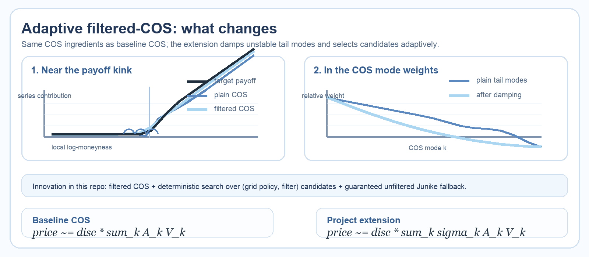

# fourier-option-pricer

Price European options under stochastic volatility and jump models using Fourier methods.

---

## What problem it solves

Most option pricing models beyond Black-Scholes do not have a price formula you can plug numbers into directly. Instead they give you the characteristic function of log-returns. This package takes that characteristic function and turns it into option prices using three deterministic Fourier methods (Carr-Madan FFT, FRFT, and COS), which are orders of magnitude faster than Monte Carlo for strip pricing and calibration.

---

## Key results

- 20 supported characteristic-function models across stochastic-volatility, jump-diffusion, pure-Levy, rough-volatility, and hybrid SVJ families
- 6 pricing engines exposed through one dispatcher: COS, improved COS, filtered COS, Carr-Madan FFT, FRFT, and Lewis quadrature
- 692 collected tests with paper, software-reference, adapter, stability, and end-to-end workflow coverage
- 27 validation-matrix rows tracked explicitly in [docs/paper_validation_matrix.md](docs/paper_validation_matrix.md): 13 `done`, 13 `partial`, 1 `xfail-if-unstable`
- Published as a PyPI package and structured as a reusable Python package rather than a notebook-only project
- Original extension included: adaptive filtered-COS on top of the published Fourier pricing methods

### Quick grading path

If you are reading this repo for course evaluation, the fastest high-signal checks are:

1. Run the fresh-clone steps in [Reproduce results](#reproduce-results).
2. Check the validation status table in [docs/paper_validation_matrix.md](docs/paper_validation_matrix.md).
3. Check benchmark and replication notes in [docs/fo2008_replication.md](docs/fo2008_replication.md), [docs/bates_sv32_validation.md](docs/bates_sv32_validation.md), and [docs/benchmarking.md](docs/benchmarking.md).

### Benchmark snapshot

Representative saved benchmark outputs from [`benchmarks/mc_vs_fourier_methods/outputs/`](benchmarks/mc_vs_fourier_methods/outputs/) show the following pattern:

| Model family | Fastest saved method | Runtime ms | Lowest saved error | Method with lowest error |
| --- | --- | ---: | ---: | --- |
| Non-jump diffusion | COS improved | 0.249 | 8.89e-13 | COS classic |
| Stochastic vol (no jumps) | COS improved | 0.306 | 9.62e-11 | COS classic |
| Pure jump | COS classic | 0.437 | 1.49e-11 | COS classic |
| Hybrid stoch vol + jumps | COS classic / improved are comparable | 0.519 to 0.559 | 3.13e-10 | COS classic |

The full per-model summary is in [`cross_model_best_summary.csv`](benchmarks/mc_vs_fourier_methods/outputs/cross_model_best_summary.csv), with family rollups in [`cross_model_family_runtime_summary.csv`](benchmarks/mc_vs_fourier_methods/outputs/cross_model_family_runtime_summary.csv) and [`cross_model_family_error_summary.csv`](benchmarks/mc_vs_fourier_methods/outputs/cross_model_family_error_summary.csv).

---

## Installation

```bash
pip install fourier-option-pricer
```

Requires Python 3.10+, `numpy>=1.26`, `scipy>=1.10`, `pyfeng>=0.4.0`.

To pin a version:

```bash
pip install "fourier-option-pricer==0.4.1"
```

---

## Quick start

```python
import numpy as np
import foureng as fe

fwd    = fe.ForwardSpec(S0=100.0, r=0.01, q=0.02, T=1.0)
params = fe.HestonParams(kappa=4.0, theta=0.25, nu=1.0, rho=-0.5, v0=0.04)

strikes = np.array([80.0, 90.0, 100.0, 110.0, 120.0])
prices  = fe.price_strip("heston", "cos_improved", strikes, fwd, params)
print(prices)
```

Swap the method string to switch pricers without touching any other code:

```python
prices = fe.price_strip("heston", "carr_madan", strikes, fwd, params)
prices = fe.price_strip("heston", "lewis",      strikes, fwd, params)
prices = fe.price_strip("bates",  "frft",       strikes, fwd, params)
```

Or call the COS pricer directly if you want more control:

```python
phi    = lambda u: fe.heston_cf_form2(u, fwd, params)
grid   = fe.cos_auto_grid(fe.heston_cumulants(fwd, params), N=256, L=10.0)
result = fe.cos_prices(phi, fwd, strikes, grid)
print(result.call_prices)
```

---

## API reference

Everything is importable from `import foureng as fe`.

### Market inputs

| Object | Parameters | Returns |
|--------|------------|---------|
| `ForwardSpec(S0, r, q, T)` | spot, risk-free rate, dividend yield, maturity | Market inputs container; also exposes `F0` and discount factor `disc`. |

### Model parameter dataclasses

| Dataclass | Key parameters | Model family |
|-----------|----------------|-------------|
| `BsmParams` | `sigma` | Black-Scholes baseline |
| `HestonParams` | `kappa, theta, nu, rho, v0` | Stochastic volatility |
| `OusvParams` | `sigma0, kappa, theta, nu, rho` | Stochastic volatility (Schobel-Zhu) |
| `Sv32Params` | `v0, kappa, theta, nu, rho` | 3/2 stochastic volatility |
| `RoughHestonParams` | `sigma, vov, mr, rho, theta, alpha` | Rough volatility |
| `GarchWMW2012Params` | `v0, kappa, theta, nu, rho` | GARCH diffusion |
| `BatesParams` | `kappa, theta, nu, rho, v0, lam_j, mu_j, sigma_j` | Heston + log-normal jumps |
| `HestonKouParams` | `kappa, theta, nu, rho, v0, lam_j, p_j, eta1, eta2` | Heston + double-exp jumps |
| `HestonCGMYParams` | `kappa, theta, nu, rho, v0, C, G, M, Y` | Heston + CGMY jumps |
| `VGParams` | `sigma, nu, theta` | Variance Gamma |
| `CgmyParams` | `C, G, M, Y` | CGMY tempered-stable |
| `NigParams` | `sigma, nu, theta` | Normal Inverse Gaussian |
| `KouParams` | `sigma, lam, p, eta1, eta2` | Double-exponential jump-diffusion |
| `MertonJDParams` | `sigma, lam, mu_j, sigma_j` | Merton jump-diffusion |
| `MeixnerParams` | `a, b, delta` | Meixner process |
| `BilateralGammaParams` | `alpha_p, lambda_p, alpha_m, lambda_m` | Bilateral Gamma |
| `GHParams` | `lam, alpha, beta, delta` | Generalised Hyperbolic |
| `FMLSParams` | `alpha, sigma` | Finite Moment Log Stable |
| `DoubleHestonParams` | `kappa1..v01, kappa2..v02` | Two-factor Heston |
| `VGSAParams` | `C, G, M, kappa, eta, lam` | VG with stochastic activity |

Full model details: [docs/model_zoo.md](docs/model_zoo.md).

### Unified dispatcher

| Function | Parameters | Returns |
|----------|------------|---------|
| `price_strip(model, method, strikes, fwd, params, grid=None)` | model label, method label, strike array, `ForwardSpec`, model params, optional grid | `np.ndarray` of call prices |

Method labels: `"cos"`, `"cos_improved"`, `"carr_madan"`, `"frft"`, `"lewis"`, `"pyfeng_fft"`.
Here `"lewis"` means the repo's own in-house Lewis Fourier inversion in `foureng/pricers/lewis.py`, while `"pyfeng_fft"` means the PyFENG-backed Lewis-style FFT path available only for PyFENG-supported models.

### Core pricing functions

| Function | Parameters | Returns |
|----------|------------|---------|
| `cos_prices(phi, fwd, strikes, grid)` | characteristic function, `ForwardSpec`, strike array, `COSGrid` | `COSResult` with `.call_prices` |
| `carr_madan_price_at_strikes(phi, fwd, grid, strikes)` | CF, `ForwardSpec`, `FFTGrid`, strike array | `np.ndarray` |
| `frft_price_at_strikes(phi, fwd, grid, strikes)` | CF, `ForwardSpec`, `FRFTGrid`, strike array | `np.ndarray` |
| `filtered_cos_prices(phi, fwd, strikes, grid, filter_spec=None)` | CF, `ForwardSpec`, strike array, `COSGrid`, optional `COSFilterSpec` | `COSResult` |

### Grid constructors

| Function / class | Parameters | Returns |
|-----------------|------------|---------|
| `cos_auto_grid(cumulants, N, L)` | cumulants, term count, truncation multiplier | `COSGrid` |
| `cos_improved_grid(cumulants, model, params)` | cumulants, model name, params | `COSGrid` via Junike truncation policy |
| `FFTGrid(N, eta, alpha)` | FFT size, frequency spacing, damping factor | Carr-Madan FFT grid |
| `FRFTGrid(N, eta, lam, alpha)` | size, freq spacing, strike step, damping | FRFT grid |

### Implied volatility

| Function | Parameters | Returns |
|----------|------------|---------|
| `BSInputs(F0, K, T, r, q, is_call)` | Black-style inversion inputs | dataclass |
| `implied_vol_newton_safeguarded(price, inputs)` | option price, `BSInputs` | `float` |
| `implied_vol_brent(price, inputs)` | option price, `BSInputs` | `float` |

### Surfaces and calibration

| Function | Parameters | Returns |
|----------|------------|---------|
| `model_iv_surface(...)` | surface spec, pricing callbacks | IV surface array |
| `calibrate_heston(...)` | market targets, grid, initial guess | `CalibrationResult` |
| `cos_price_and_greeks(phi, fwd, strikes, grid)` | CF, `ForwardSpec`, strikes, grid | `COSGreeks` with prices, delta, gamma |

Full reference for all 70+ public objects: [docs/api_reference.md](docs/api_reference.md).

---

## License

MIT. See [LICENSE](LICENSE).

---

## Demo notebook

[](https://colab.research.google.com/github/nl2992/fourier-option-pricer/blob/main/notebooks/demo.ipynb)

[`notebooks/demo.ipynb`](notebooks/demo.ipynb) is the best starting point: Carr-Madan, COS, and FRFT on a Heston strip, runnable in Colab with no local setup.

[`notebooks/demo_advanced.ipynb`](notebooks/demo_advanced.ipynb) covers everything in one place: all 20 models, all 6 pricers, Greeks, IV surface, Heston calibration, Monte Carlo, new models (Double Heston, VGSA), and validation highlights.

---

## More notebooks

### Paper replications

| Notebook | Paper / reference | What it shows |
|----------|-------------------|---------------|
| [`cosPaper_Replication.ipynb`](notebooks/cosPaper_Replication.ipynb) | Fang & Oosterlee (2008) | Table 2 BSM baseline, Heston scalar and strip cases, VG and CGMY; scoreboard and error figures. |
| [`fo2008_replication.ipynb`](notebooks/fo2008_replication.ipynb) | Fang & Oosterlee (2008) full replay | Paper-faithful Tables 2, 5, 7, 8-10 (BSM, Heston, VG, CGMY) plus benchmark CSVs. |
| [`paper_replications/bates_mathworks_replication.ipynb`](notebooks/paper_replications/bates_mathworks_replication.ipynb) | MathWorks optByBatesNI / FFT | All-engine scoreboard vs frozen MathWorks reference; error plots, assertion gate, CSV. |
| [`paper_replications/three_halves_replication.ipynb`](notebooks/paper_replications/three_halves_replication.ipynb) | Lewis (2000); Baldeaux & Badran (2012) | 3/2 SV: PyFENG regression and qualitative IV smile shape checks. |
| [`paper_replications/bates_sv32_validation_demo.ipynb`](notebooks/paper_replications/bates_sv32_validation_demo.ipynb) | MathWorks Bates + frozen pyfeng_fft surface | 12-section validation: BATES-01 to 07 and SV32-01 to 05; assertion gates and benchmark CSVs. |

### Research notebooks

| Notebook | What it covers |
|----------|---------------|
| [`research/cos_method_improved.ipynb`](notebooks/research/cos_method_improved.ipynb) | Junike-Pankrashkin (2022) / Junike (2024) improved truncation: three pricing strategies, Heston T=10 stress case, visual diagnostics. |
| [`research/adaptive_cos.ipynb`](notebooks/research/adaptive_cos.ipynb) | Adaptive filtered-COS: BSM, Heston, VG, CGMY; comparison with plain COS and filtered COS. |

[`notebooks/presentation_fourier_methods.ipynb`](notebooks/presentation_fourier_methods.ipynb) is a lecture-style walkthrough covering Monte Carlo vs Carr-Madan, Lewis FFT parameter sensitivity, plain COS, improved COS, multi-model sweep, and conclusions.

---

## How the methods work

### Why Fourier methods instead of Monte Carlo?

Monte Carlo standard error decays as O(n^(-1/2)). Cutting the error by a factor of 10 costs roughly 100x more paths. In a calibration loop that prices across dozens of strikes and maturities repeatedly, that compounds fast.

Fourier methods price a whole strike strip from one characteristic function evaluation and a deterministic transform, giving a much cleaner speed-accuracy trade-off for vanilla options.

### The characteristic function backbone

All three pricers start from the same input:

$$
\varphi_T(u) = \mathbb{E}^{\mathbb{Q}}\\left[e^{iuX_T}\right],
\qquad
X_T = \log\\left(\frac{S_T}{F_0}\right).
$$

This is the characteristic function in **log-forward coordinates** (`X_T = log(S_T / F_0)`, not `log(S_T)`). Mixing log-spot and log-forward CFs creates a systematic pricing error, so the convention is enforced throughout the codebase.

### Carr-Madan FFT

Carr and Madan (1999) damp the call price in log-strike space with `exp(alpha * k)` to make it square-integrable, then invert the FFT on a uniform frequency grid to recover prices on a uniform log-strike lattice.

Key parameters: damping factor `alpha`, frequency spacing `eta`, FFT size `N`, log-strike spacing `lambda = 2*pi / (N*eta)`. Strike and frequency resolution are coupled, so finer strike resolution requires either a larger grid or FRFT.

### Fractional FFT (FRFT)

FRFT (Chourdakis 2004) relaxes that coupling so the frequency and strike grids can be chosen more freely. Useful when the target strikes do not fall on the natural Carr-Madan lattice, or when a finer strike grid is needed without blowing up N.

### COS method

The COS method (Fang & Oosterlee 2008) expands the log-return density on a truncated interval `[a, b]` using a Fourier-cosine series. The expansion coefficients come directly from evaluating the characteristic function at equally spaced frequencies.

The standard cumulant-based truncation rule is:

$$
[a, b] = \\left[
c_1 - L\sqrt{c_2 + \sqrt{|c_4|}},\;
c_1 + L\sqrt{c_2 + \sqrt{|c_4|}}
\right]
$$

Accuracy depends on both the interval width and the number of terms N. Getting one right without the other is not enough.

### Improved COS (Junike-Pankrashkin / Junike)

A fixed multiplier L is a heuristic. If `[a, b]` is too narrow, the method loses tail mass before the series even starts and no amount of extra N terms can get it back. If it is too wide, more terms are needed to resolve it.

Junike and Pankrashkin (2022) replace the multiplier with a tail-mass tolerance, choosing the half-width M to satisfy:

$$
M \geq \left(\frac{\mathbb{E}[|X_T - m|^n]}{\varepsilon_{\text{trunc}}}\right)^{1/n}
$$

Junike (2024) adds a companion result for how many terms N are needed to resolve the chosen interval to a target accuracy. The `cos_improved` path in this package implements both. Full derivations are in [appendix.md](appendix.md) sections 7 and 14.

---

## Innovation: adaptive filtered-COS

Even with a well-chosen `[a, b]`, the finite COS series can still show oscillation when the density has sharp features, the model is short-maturity and jump-heavy, or the characteristic function decays slowly.

**This is an original project extension, not a paper replication.**
The idea is **inspired by** spectral-filter work such as Ruijter, Versteegh and Oosterlee (2015). In this repo, it appears as an original adaptive filtered-COS extension rather than a direct replication of a published adaptive filtered-COS workflow. The project contribution is the combination of:

1. a filtered-COS pricing layer on top of the standard COS machinery,
2. a deterministic search across filter and grid-policy candidates,
3. a selection rule that always keeps the unfiltered Junike-style candidate available.



Our innovation on top of that inspiration is the policy layer: we keep the same characteristic function, truncation logic, and payoff coefficients, then add spectral damping and choose among explicit `(grid policy, filter)` candidates while always preserving the unfiltered Junike-style path as a fallback.

Plain COS keeps the usual payoff sum

```
price = disc * sum_k  A_k * V_k
```

while the project extension adds spectral weights `sigma_k` that damp the high-frequency COS modes before the final sum:

```
price = disc * sum_k  sigma_k * A_k * V_k
```

with `sigma_k in [0, 1]`, near one for the low modes and smaller in the tail modes.

Four filter families are available: Fejer, Lanczos, raised-cosine, and exponential. A deterministic policy-search selector compares candidates from `(COSGridPolicy, COSFilterSpec)` pairs and returns the fastest one that meets the user's error tolerance, with the no-filter Junike candidate always included.

On the FO2008 test suite the adaptive selector beats the naive paper-grid replay in 7 of 8 cases and beats the paper's best reported error in 6 of 8 cases.

Full details: [docs/filtered_cos_extension.md](docs/filtered_cos_extension.md). Demo: [`notebooks/research/adaptive_cos.ipynb`](notebooks/research/adaptive_cos.ipynb).

---

## Validation summary

| Model / method group | Reference | Tolerance | Status |
|----------------------|-----------|-----------|--------|
| Carr-Madan VG Case 4 put prices | Paper table, Carr & Madan (1999) | exact to 4 d.p. | done |
| Lewis Heston five-strike strip | Paper table, Lewis (2001) | atol=1e-5 | done |
| Double Heston vanilla calls | Paper table, Kelly (2025) | atol=1e-4 | done |
| Bates NI prices | MathWorks `optByBatesNI` | atol=1e-2 | done |
| Bates FFT/FRFT surface | MathWorks `optByBatesFFT` | atol=1e-2 | done |
| Bates Delta | MathWorks `optSensByBatesNI` | atol=5e-3 | done |
| BSM all-pricers baseline | Frozen derived reference | COS/COS+: 1e-8; Lewis: 1e-7; CM/FRFT: 1e-4; PyFENG: 1e-5 | done |
| 3/2 SV PyFENG surface (7x4) | Frozen PyFENG adapter reference | atol=1e-3 | done |
| Merton JD | Derived reference (Poisson-BSM mixture) | atol=1e-8 | done |
| FO2008 COS Tables 1-10 | Derived reference, paper-grid replay | see [fo2008_replication.md](docs/fo2008_replication.md) | partial |
| Heston, VG, CGMY, NIG, OUSV, Rough Heston | PyFENG adapter parity | atol=1e-5 | partial |
| Kou, Bilateral Gamma, GH, FMLS, Meixner, VGSA | Derived reference, cross-method | atol=1e-4 | partial |

Full per-paper matrix: [docs/paper_validation_matrix.md](docs/paper_validation_matrix.md). Evidence-level definitions: [docs/validation_hierarchy.md](docs/validation_hierarchy.md).

---

## Reproduce results

```bash
# fresh clone / fork setup
git clone https://github.com/<your-user>/fourier-option-pricer.git
cd fourier-option-pricer
python3 -m venv .venv
source .venv/bin/activate
python -m pip install --upgrade pip

# install test dependencies for the fast CI-style suite
python -m pip install -e ".[test]"

# fast CI suite (skips slow notebook tests)
python -m pytest -q -m "not slow"

# add notebook dependencies for the full suite and notebook execution guards
python -m pip install -e ".[test,notebook]"

# full suite including Monte Carlo and notebook guards
python -m pytest -q

# paper-replication tests only
python -m pytest -q -m "paper"

# MathWorks Bates software-reference tests
python -m pytest -q -m "software_reference"

# FO2008 COS benchmarks
python -m pytest -q tests/papers/test_phase4_cos_heston_fo2008.py

# run the Bates + SV32 validation notebook (needs pyfeng>=0.4.0)
python -m jupyter nbconvert --to notebook --execute \
  notebooks/paper_replications/bates_sv32_validation_demo.ipynb
```

The repository has **692 pytest cases**.

### Quick verification for a fork

If you only want to confirm that a fresh environment is healthy, these three checks are enough:

```bash
python -m pip install -e ".[test]"
python - <<'PY'
import numpy as np
import foureng as fe
fwd = fe.ForwardSpec(S0=100.0, r=0.01, q=0.02, T=1.0)
params = fe.HestonParams(kappa=4.0, theta=0.25, nu=1.0, rho=-0.5, v0=0.04)
K = np.array([80.0, 90.0, 100.0, 110.0, 120.0])
print(fe.price_strip("heston", "cos_improved", K, fwd, params))
PY
python -m pytest -q -m "not slow"
```

For notebook execution checks:

```bash
python -m pip install -e ".[test,notebook]"
python -m pytest -q tests/features/test_paper_replication_notebooks_execute.py
```

For developer quality checks:

```bash
python -m pip install -e ".[dev]"
ruff check foureng/ tests/
ruff format --check foureng/ tests/
python -m mypy foureng
```

For optional performance regression tracking:

```bash
python -m pip install -e ".[bench]"
python benchmarks/pyperf_canonical_cases.py
```

---

## Project contribution

This is not a reimplementation of existing characteristic functions. The contributions are:

1. A uniform `price_strip` dispatcher that prices any of 20 models by any of 6 methods with one function call.
2. Twelve in-house characteristic-function models on top of the eight PyFENG-backed adapters, including four SVJ composites and six pure-Levy models.
3. A structured validation harness with 692 test cases across [five evidence levels](docs/validation_hierarchy.md).
4. Improved COS truncation following Junike-Pankrashkin (2022) and Junike (2024), demonstrated on the [full FO2008 test suite](docs/fo2008_replication.md).
5. Adaptive filtered-COS as an original extension.

---

## Course rubric map

| Rubric criterion | Where to find it |
|-----------------|-----------------|
| Mathematical background and derivations | [appendix.md](appendix.md) sections 7 (characteristic functions), 8 (pricing methods), 14 (Junike theory) |
| Implementation quality | `foureng/pricers/`, `foureng/models/`, `foureng/utils/`, `pipeline.py` |
| Validation against published benchmarks | [docs/validation_hierarchy.md](docs/validation_hierarchy.md); [docs/paper_validation_matrix.md](docs/paper_validation_matrix.md); `tests/papers/`, `tests/models/` |
| Extension / innovation | [docs/filtered_cos_extension.md](docs/filtered_cos_extension.md); `notebooks/research/adaptive_cos.ipynb` |
| Notebook demonstrations | `notebooks/demo.ipynb`, `notebooks/demo_advanced.ipynb`, `notebooks/paper_replications/` |
| FO2008 paper replication | [docs/fo2008_replication.md](docs/fo2008_replication.md); `notebooks/fo2008_replication.ipynb` |
| Bates and 3/2 SV validation | [docs/bates_sv32_validation.md](docs/bates_sv32_validation.md); `notebooks/paper_replications/bates_sv32_validation_demo.ipynb` |
| Code quality / reproducibility | `pyproject.toml`, `tests/`, CI workflow; see [Reproduce results](#reproduce-results) |
| AI workflow / original contribution | [docs/ai_workflow_and_contribution.md](docs/ai_workflow_and_contribution.md) |

### Marker quickstart

For a fast grading pass, the highest-signal checks are:

1. Run the fork setup and fast suite in [Reproduce results](#reproduce-results).
2. Check [docs/paper_validation_matrix.md](docs/paper_validation_matrix.md) for paper-by-paper evidence and status.
3. Check [docs/fo2008_replication.md](docs/fo2008_replication.md) and [docs/bates_sv32_validation.md](docs/bates_sv32_validation.md) for benchmark details.
4. Inspect `foureng/models/`, `foureng/pricers/`, and `foureng/pipeline.py` for class/package structure and method separation.
5. Inspect `benchmarks/` and `tests/` for saved outputs, robustness checks, and reproducibility assets.

### Coding quality and efficiency practices used here

- Clear separation of concerns: model characteristic functions, pricing engines, utilities, and validation assets live in separate modules.
- Package-style public API: top-level `import foureng as fe` exposes the intended surface, while internals remain grouped by responsibility.
- Vectorized numerical code: strip pricing uses NumPy arrays rather than Python loops where practical.
- Cross-method regression checks: COS, FRFT, Carr-Madan, Lewis, and PyFENG-backed paths are compared against each other and against references.
- Frozen reference fixtures: paper anchors, JSON fixtures, and benchmark CSVs make regressions detectable and reproducible.
- Reproducible CI path: editable install, fast suite, notebook smoke tests, package build, and Twine metadata checks are all scriptable from the repo.

### Robustness and testing practices used here

- Multi-layer validation: unit tests, paper-replication tests, notebook execution guards, and software-reference checks cover different failure modes.
- Published anchors first: FO2008, Bates, Kou, Junike, and related references are used as explicit correctness targets rather than informal spot checks.
- Cross-environment reproducibility: the repository supports fresh-clone setup, editable install, and interpreter-pinned notebook execution.
- Randomized and edge-case coverage: the test suite includes parameter sweeps, shape checks, and numerical sanity checks across multiple models.
- Output-bundle verification: benchmark artifacts are checked for required summaries, tables, and files so saved research outputs stay complete.

---

## AI-assisted development workflow

AI tools were used for research assistance, implementation planning, code generation, and documentation restructuring. The workflow was source-driven: Deep Research identified papers, formulas, and benchmark numbers; reasoning models converted those into implementation TODOs; coding agents handled first-pass implementation and restructuring; and final acceptance required human review, passing tests, working notebooks, and CI.

Full workflow, library reuse policy, original contributions, and validation gates: [docs/ai_workflow_and_contribution.md](docs/ai_workflow_and_contribution.md).

---

## Testing layout

| Folder | Contents |
|--------|----------|
| `tests/refs/` | Frozen JSON reference files: MathWorks Bates, PyFENG 3/2 surface, Baldeaux-Badran figure parameters. |
| `tests/papers/` | Paper and software-reference replications: Carr-Madan, Lewis, FRFT, FO2008 COS, Kou, all six Bates pricer tests, 3/2 SV qualitative smoke test. |
| `tests/models/` | Model adapter, regression-strip, and reduction-limit tests for all 20 models. |
| `tests/methods/` | Pricer behavior: COS policies, filters, alpha validity, cross-method agreement, robustness sweeps. |
| `tests/features/` | End-to-end features: Monte Carlo, control variates, implied vol, calibration, Greeks, public API. |

See [tests/README.md](tests/README.md) for the full folder map.

Contributor guide: [CONTRIBUTING.md](CONTRIBUTING.md). Benchmark notes: [docs/benchmarking.md](docs/benchmarking.md). Citation metadata: [CITATION.cff](CITATION.cff).

---

## Repository map

```
foureng/
  models/      20 CF models (PyFENG-backed adapters and in-house implementations)
  pricers/     carr_madan, frft, cos, cos_improved, filtered_cos, lewis
  utils/       grids, cumulants, implied volatility, spectral filters
  iv/          implied volatility routines
  mc/          Monte Carlo baselines (BSM and Heston conditional MC)
  pipeline.py  unified price_strip dispatcher

tests/
  refs/        frozen JSON reference fixtures
  papers/      paper and software-reference replication tests
  models/      per-model validation suites
  methods/     pricer-method behavior tests
  features/    end-to-end feature tests

notebooks/
  demo.ipynb, demo_advanced.ipynb
  presentation_fourier_methods.ipynb
  paper_replications/
  research/
  fo2008_replication.ipynb, cosPaper_Replication.ipynb

benchmarks/
  paper_replications/fo2008_cos/  params.py, outputs/ (CSVs, PNGs, summary.md)
  mc_vs_fourier_methods/outputs/

docs/           detailed reference documentation (index at docs/README.md)
.github/        CI and test matrix
```

---

## Key papers

| Topic | Reference |
|-------|-----------|
| Carr-Madan FFT | Carr, P. and Madan, D.B. (1999), *Option Valuation Using the Fast Fourier Transform* |
| FRFT | Chourdakis, K. (2004), *Option Pricing Using the Fractional FFT* |
| COS method | Fang, F. and Oosterlee, C.W. (2008), *A Novel Pricing Method for European Options Based on Fourier-Cosine Series Expansions* |
| Improved COS truncation | Junike, G. and Pankrashkin, K. (2022), *Precise Option Pricing by the COS Method: How to Choose the Truncation Range* |
| COS term-count policy | Junike, G. (2024), *On the Number of Terms in the COS Method for European Option Pricing* |
| Spectral filtering | Ruijter, M.J., Versteegh, M. and Oosterlee, C.W. (2015), *On the Application of Spectral Filters in a Fourier Option Pricing Technique* |
| Heston SV | Heston, S.L. (1993), *A Closed-Form Solution for Options with Stochastic Volatility* |
| Stable Heston CF | Albrecher, H. et al. (2007), *The Little Heston Trap* |
| Lewis benchmark | Lewis, A.L. (2001), *A Simple Option Formula for General Jump-Diffusion and Other Exponential Levy Processes* |
| Variance Gamma | Madan, D.B., Carr, P. and Chang, E.C. (1998), *The Variance Gamma Process and Option Pricing* |
| Kou jump-diffusion | Kou, S.G. (2002), *A Jump-Diffusion Model for Option Pricing* |
| Bates SVJ | Bates, D.S. (1996), *Jumps and Stochastic Volatility: Exchange Rate Processes Implicit in Deutsche Mark Options* |

Full bibliography with DOIs and free-access links: [docs/papers.md](docs/papers.md).

---

## Detailed documentation

All reference documentation is indexed at **[docs/README.md](docs/README.md)**  -  model zoo, full API, validation hierarchy, paper replication tables, filtered-COS extension, Bates/3/2 SV validation, AI workflow, and packaging checklist.

| Document | Contents |
|----------|----------|
| [appendix.md](appendix.md) | Methodology, derivations, model conventions, benchmark interpretation, and the numbered course-project narrative (sections 1–18). |
| [docs/papers.md](docs/papers.md) | Full bibliography with DOIs and free-access links, grouped by method and model family. |
| [docs/numerical_notes.md](docs/numerical_notes.md) | Known numerical limitations: COS truncation failure modes, Carr-Madan alpha conditions, PyFENG version caveats, parameter edge cases, IV inversion guidance. |
