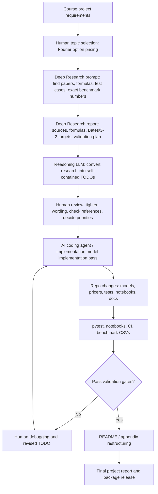

# AI-Assisted Development Workflow, Library Reuse, and Original Contribution

---

## 1. Purpose of this document

This document answers the marker's three assessment questions about AI use in this project:

1. **How AI was prompted**  -  what kinds of prompts were used and what they were expected to produce.
2. **How existing libraries and code were reused**  -  which mature packages were used as-is rather than reimplemented.
3. **What was added beyond the reference papers**  -  the original work that goes beyond reproducing existing results.

It also records human review and control points, validation gates, and the project's scope and evidence boundaries.

---

## 2. Summary of AI-assisted workflow

AI tools were used at four distinct stages:

| Stage | Tool | Purpose |
|-------|------|---------|
| Research | Deep Research (GPT-based) | Identify academic papers, extract formulas, find exact benchmark numbers, locate official software examples |
| Planning | Reasoning LLM | Convert research reports into self-contained implementation TODOs with file names, expected outputs, and tolerances |
| Implementation | AI coding agent / implementation model | First-pass code generation, test writing, notebook authoring, documentation restructuring |
| Review | Human | Check sources, tighten wording, verify conventions, run tests, approve or revise |

The AI workflow was **iterative and source-driven**, not one-shot or freeform. At no stage was AI output accepted without human checking.

---

## 3. Workflow diagram



The AI workflow was iterative rather than one-shot. Deep Research was used to identify sources and benchmark targets. Reasoning models were then used to turn the research into implementation TODOs. AI coding agent / implementation model was used for coding and restructuring passes. Human review sat between each stage: we checked whether sources had exact numerical values, whether wording stayed proportionate to the evidence, whether the implementation matched the repo convention, and whether tests passed.

---

## 4. How AI was prompted

AI was not prompted with vague requests such as "build an option pricer." The prompts were source-driven and validation-driven.

The main prompt pattern was:

1. inspect the existing repository;
2. identify what had already been implemented;
3. search for academic or practical benchmark sources;
4. extract exact formulas, parameters, strikes, maturities, and expected outputs;
5. separate exact numerical references from figure-only references;
6. convert the research into file-level TODOs;
7. specify expected test behaviour and tolerances;
8. produce notebook demonstration plans.

**Example prompt:**

```text
Inspect the repository and existing TODOs. For Bates and 3/2 stochastic volatility,
find exact paper or official software benchmark cases with inputs and expected outputs.
Separate true paper tables from software examples and qualitative figures. Turn the
result into a self-contained implementation TODO for tests and notebooks, including
file names, tolerances, and expected behaviour.
```

Deep Research outputs were used as source summaries, not as final code. For example, a Bates and 3/2 Deep Research run identified MathWorks Bates prices as exact numerical references, while correctly flagging Baldeaux-Badran 3/2 outputs as figure-only rather than hard unit-test targets  -  a distinction that directly shaped the five-level validation hierarchy in [docs/validation_hierarchy.md](validation_hierarchy.md).

For documentation restructuring, the prompts were equally specific:

```text
The README is 327 lines and too bloated for a marker. Move the full API table to
docs/api_reference.md, the 20-model table to docs/model_zoo.md, and the FO2008
replication tables from APPENDIX sections 12-13 to docs/fo2008_replication.md.
Rewrite README.md as a 2500-4000 word project report with a course rubric map,
problem-solved section, innovation section, and links to all new docs files.
```

---

## 5. Human review and control points

AI outputs were manually reviewed before implementation. The human checks were:

- whether a cited source actually contained exact numerical values;
- whether a paper only had plotted figures rather than tables;
- whether the model convention matched the repo convention `X_T = log(S_T / F0)`;
- whether a reference was a paper reference, official software reference, adapter reference, derived reference, or qualitative figure check;
- whether the proposed test tolerance matched the precision of the source;
- whether a task was already completed in the repo;
- whether the final wording would be defensible to a marker.

**Concrete examples of human review decisions:**

- Bates was not presented as a native PyFENG model because `price_strip(..., method="pyfeng_fft")` does not support Bates. It is described as an in-house implementation validated against official MathWorks examples.
- 3/2 SV was described as PyFENG-backed rather than fully in-house, because the characteristic function comes from `pyfeng.sv_fft`.
- Baldeaux-Badran 3/2 parameters were kept as qualitative figure checks (`xfail-if-unstable`) because the paper does not provide exact vanilla option price tables.
- MathWorks tolerances were set to `atol=1e-2` (not 1e-4) after diagnosing a ~7.6e-3 grid-convention gap between the repo's `log(F0)`-centred grid and the MathWorks FFT convention, plus 4-decimal truncation in the published values.

---

## 6. Reuse of existing libraries and code

The project deliberately reused mature numerical libraries instead of reimplementing
everything from scratch.

| Library / tool | How it was used | Why reuse was appropriate |
|----------------|-----------------|--------------------------|
| NumPy | Vectorised arrays, grids, characteristic-function evaluation, pricing strips | Core numerical array library; avoids slow Python loops |
| SciPy | Numerical integration, optimisation, special functions | Standard scientific Python infrastructure |
| PyFENG | Backend characteristic functions for 8 supported models; FFT pricer oracle | Mature quant-finance package; avoids reimplementing reliable model backends |
| pytest | Unit tests, paper-reference tests, robustness tests | Standard testing framework |
| GitHub Actions | CI, paper tests, package build checks | Reproducibility and package quality |
| build / twine | Package build and PyPI validation | Standard PyPI packaging tools |

The project did **not** try to rewrite PyFENG. Instead, PyFENG was reused where it already
had mature implementations. The project added:
- a unified pricing interface that dispatches to PyFENG where available and to in-house
  pricers otherwise;
- twelve in-house characteristic-function models not in PyFENG's supported set;
- a structured validation harness across all models;
- filtered-COS and improved-COS extensions;
- paper-replication notebooks and benchmark CSVs.

The repo explicitly separates PyFENG-backed models from in-house models.
PyFENG-backed models can use `method="pyfeng_fft"` in addition to all other methods; here `pyfeng_fft` is the PyFENG-backed Lewis-style FFT route, separate from the repo's own `method="lewis"` implementation.
In-house models use the repo's own COS, Carr-Madan, FRFT, filtered-COS, and Lewis paths.

---

## 7. What we implemented ourselves

The project's own implementation work includes:

1. **Unified `price_strip` dispatcher**  -  one call prices any of 20 models by any of 6 methods without model-specific wiring (`foureng/pipeline.py`).
2. **In-house pricers**  -  Carr-Madan FFT, FRFT, COS, improved COS (Junike-Pankrashkin truncation + Junike term-count policy), filtered COS, and Lewis Fourier inversion (`foureng/pricers/`).
3. **In-house characteristic functions** for 12 models not available via PyFENG: Kou, Bates, Heston-Kou, Heston-CGMY, GARCH-WMW2012, Merton JD, Meixner, Bilateral Gamma, Generalised Hyperbolic, FMLS, Double Heston, VGSA.
4. **Cumulant functions** for all 20 models, used for COS grid construction.
5. **Spectral-filter utilities**  -  Fejér, Lanczos, raised-cosine, exponential filters (`foureng/utils/spectral_filters.py`).
6. **Adaptive policy selector**  -  deterministic grid-search over `(COSGridPolicy, COSFilterSpec)` candidate sets (`foureng/experiments/cos_filter_grid_search.py`).
7. **Structured test infrastructure**  -  732 pytest cases across five evidence levels; frozen JSON reference fixtures; model-reduction gates; cross-method agreement checks.
8. **Paper-replication and validation notebooks**  -  10 notebooks covering FO2008, Bates MathWorks, 3/2 SV, improved COS, adaptive filtered COS, and advanced demos.

---

## 8. What we added beyond the reference papers

### 8.1 Unified multi-method pricing engine

The reference papers each present one method in isolation. This repo compares all six
methods under one interface on the same model and strike strip:

```python
for method in ["cos", "cos_improved", "carr_madan", "frft", "lewis", "pyfeng_fft"]:
    prices = fe.price_strip("heston", method, strikes, fwd, params)
```

This lets accuracy and runtime be compared directly across methods without changing
any model or market-input code.

### 8.2 Twenty-model validation universe

The model registry supports 20 characteristic-function models across stochastic-volatility,
SVJ-composite, pure-Lévy, and multi-factor families. This gives a wider stress-test universe
than any single reference paper and demonstrates that the common CF interface generalises
naturally beyond the FO2008 / Heston / VG benchmark set.

### 8.3 Bates native implementation and MathWorks validation

Bates (1996) does not publish clean vanilla option price tables  -  it presents fitted
exchange-rate smiles. The project therefore uses the MathWorks Financial Toolbox
(`optByBatesNI`, `optByBatesFFT`, `optSensByBatesNI`) as an official software reference.

Bates is implemented as a Heston block plus a martingale-corrected Merton lognormal jump
block under the repo's log-forward convention, validated across 7 test cases (BATES-01–07)
covering scalar prices, five-strike strips, a 5×6 surface, COS N-convergence, IV smile,
FRFT surface cross-check, and delta.

### 8.4 3/2 SV integration and systematic cross-validation

3/2 SV is exposed through the same repo API using PyFENG's `Sv32Fft` backend. The project
validates it through five systematic cases (SV32-01–05): frozen pyfeng_fft surface
regression, COS vs PyFENG cross-check, Lewis stability at T≥0.5, IV surface shape, and
N-convergence  -  distinguishing what can be tested exactly from what can only be checked
qualitatively (the Baldeaux-Badran figure parameters).

### 8.5 Adaptive filtered-COS extension

The main original extension goes beyond the Junike truncation policy. Even with a correctly
chosen `[a, b]`, the finite COS series can carry Gibbs-like oscillations when:
- the density has sharp features (short maturities, jump-heavy models);
- the characteristic function decays slowly (heavy-tailed Lévy processes);
- Greeks are needed (kink in the payoff propagates into the delta estimate).

The filtered version modifies the COS summation:

```
price = disc * Σ_k  σ_k · A_k · V_k
```

where `σ_k` is a spectral weight near 1 for low-frequency terms and smaller toward the tail.
Four filter families are available (Fejér, Lanczos, raised-cosine, exponential).

The adaptive selector compares no-filter and filtered candidates and returns the **fastest
candidate satisfying a tolerance target**  -  with the no-filter Junike candidate always in
the pool, so the selector weakly dominates fixed Junike-COS in the joint (error, runtime)
metric under the tested grid.

**Result:** on the FO2008 test suite the adaptive selector beats the naive paper-grid replay
in 7/8 cases and beats the paper's best reported error in 6/8 cases.

> Filtered COS is best interpreted as an additional stability control. The adaptive selector
> then chooses the best candidate within a defined candidate set and tolerance rule.

### 8.6 Five-level validation hierarchy

The project formalises a five-level evidence classification for all test cases:
`external_reference` → `software_reference` → `derived_reference` → `adapter` →
`qualitative_figure` / `numerical_stability`.

This makes explicit what "validated" means for each model and method combination, and
allows the project to distinguish between "we matched a published table" and "we matched
a frozen internal reference"  -  a distinction that matters when evaluating evidence.

---

## 9. Validation gates before accepting AI-generated code

Generated code was accepted only after passing validation gates:

| Gate | Purpose |
|------|---------|
| `φ(0) = 1` | Characteristic-function normalisation |
| `φ(−i) = 1` | Martingale condition under log-forward convention |
| Conjugacy `φ(−u) = conj(φ(u))` | Real-valued return distribution |
| Model reductions | Bates at λ_J=0 reduces to Heston; Merton JD at λ=0 reduces to BSM |
| Cross-method agreement | COS, FFT, FRFT, Lewis, and PyFENG agree where applicable |
| Paper / software benchmark replication | Published or official reference values reproduced within stated tolerance |
| No-arbitrage checks | Prices non-negative, call decreasing in strike, convex in strike |
| Notebook execution | Demos run end-to-end and save benchmark CSVs |
| CI pass | Lint, fast test suite, paper tests, and package build run on GitHub Actions |

Tests that check these gates live in `tests/models/` (model-structural tests),
`tests/papers/` (paper and software-reference replications), and `tests/methods/`
(cross-method and robustness checks).

---

## 10. Scope and evidence boundaries

The project is framed with the following scope and evidence boundaries:

- AI served as a research and implementation assistant; mathematical verification still passed through human review and test gating.
- AI-generated citations and benchmark numbers were cross-checked before being accepted into the repo.
- Bates is validated through the repo's Fourier implementations and official external examples rather than through native PyFENG FFT support, since `method="pyfeng_fft"` does not cover Bates.
- Bates (1996) is used for model specification and background, while the exact vanilla price tables in the tests come from later benchmark sources.
- Baldeaux-Badran supports the 3/2 SV discussion primarily at the qualitative-figure level in this repo, so those checks remain `qualitative_figure` and `xfail-if-unstable`.
- 3/2 plus jumps is discussed as a potential extension but is not yet a fully registered model in the current package.
- Filtered COS is presented as a complementary stability tool rather than a universal replacement for standard COS.
- Some model-method combinations are validated against software references or frozen internal references because an exact published-paper price table is not available in matching form.
- AI-generated first-pass code entered the project only after human revision, source checks, and automated validation.

---

## 11. Links to evidence in the repository

| Evidence | Location |
|----------|----------|
| Package entry point | `foureng/__init__.py` |
| Unified dispatcher | `foureng/pipeline.py` |
| Spectral filters | `foureng/utils/spectral_filters.py` |
| Filtered COS pricer | `foureng/pricers/filtered_cos.py` |
| Bates model | `foureng/models/bates.py` |
| 3/2 model | `foureng/models/sv32.py` |
| Paper validation matrix | `docs/paper_validation_matrix.md` |
| Validation hierarchy | `docs/validation_hierarchy.md` |
| Bates / 3/2 validation notes | `docs/bates_sv32_validation.md` |
| FO2008 replication tables | `docs/fo2008_replication.md` |
| Filtered-COS extension | `docs/filtered_cos_extension.md` |
| Model zoo | `docs/model_zoo.md` |
| Paper replication notebooks | `notebooks/paper_replications/` |
| Research notebooks | `notebooks/research/` |
| All tests | `tests/` |
| Frozen reference fixtures | `tests/refs/` |
| CI workflow | `.github/workflows/` |
