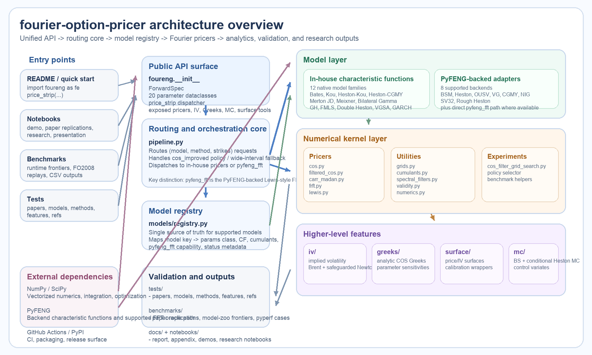

# Architecture Overview

This diagram shows how the package is organised from user-facing entry points down to pricing kernels, model characteristic functions, and validation outputs.

## Reading the layers

- `README`, notebooks, benchmarks, and tests all meet the same public API surface exposed through `import foureng as fe`.
- [`foureng/pipeline.py`](../foureng/pipeline.py) is the routing hub. It interprets `(model, method, strikes, fwd, params, grid)`, applies the improved-COS / filtered-COS policy logic, and dispatches to the correct pricing engine.
- [`foureng/models/registry.py`](../foureng/models/registry.py) is the single source of truth for supported models, parameter dataclasses, characteristic functions, cumulants, and backend metadata.
- The numerical kernel layer is split into pricing engines in [`foureng/pricers/`](../foureng/pricers), supporting utilities in [`foureng/utils/`](../foureng/utils), and research policy tooling in [`foureng/experiments/`](../foureng/experiments).
- Higher-level modules in [`foureng/iv/`](../foureng/iv), [`foureng/greeks/`](../foureng/greeks), [`foureng/surface/`](../foureng/surface), and [`foureng/mc/`](../foureng/mc) reuse the same model / pricer foundations rather than maintaining separate pricing logic.
- Tests, benchmark bundles, research notebooks, and report documents form the validation and reporting layer on top of the package.

## Key distinctions

- `lewis` refers to the repo's in-house Lewis inversion implementation in [`foureng/pricers/lewis.py`](../foureng/pricers/lewis.py).
- `pyfeng_fft` is the PyFENG-backed Lewis-style FFT route, available only for PyFENG-supported backends.
- The adaptive filtered-COS extension keeps the same core COS machinery and adds deterministic candidate selection over `(grid policy, filter)` combinations.

## Editable source

- Mermaid flowchart source: [docs/assets/architecture_overview.mmd](assets/architecture_overview.mmd)
- If you want to restyle or rebuild the diagram later, start from the Mermaid source and keep the PNG as the rendered snapshot used by the README/docs.
